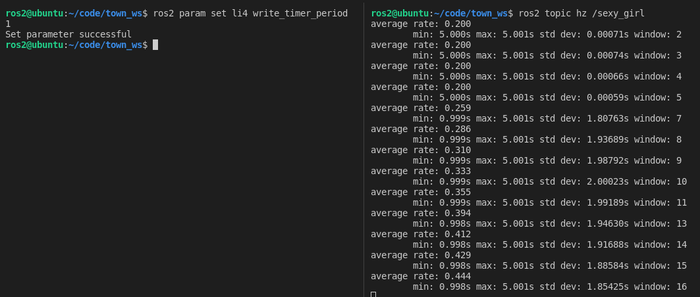

# 5.3使用Python玩转参数

大家好，我是可爱的小鱼 。本节小鱼带你一起学习使用Python将李四节点中小写说timer周期变成一个可以动态修改的参数。

## 1.代码编写

打开vscode，打开li4.py，把目光放到下面这行代码上

```
class WriterNode(Node)
```

这行程序告诉我们，WriterNode是继承于rclpy.node.Node的。所以李四获取到了参数相关的能力：

| 函数名称               | 描述                                                         |
| ---------------------- | ------------------------------------------------------------ |
| **declare_parameter**  | 声明和初始化一个参数                                         |
| **declare_parameters** | 声明和初始化一堆参数                                         |
| **get_parameter**      | 通过参数名字获取一个参数                                     |
| **get_parameters**     | 通过多个参数名字获取多个参数                                 |
| **set_parameters**     | 设置一组参数的值                                             |
| 更多函数               | [Node — rclpy 0.6.1 documentation (ros2.org)](https://docs.ros2.org/latest/api/rclpy/api/node.html) |

完成修改李四编写速度的参数，我们需要做两步即可，声明参数和获取参数

### 1.1 声明参数

修改`__init__`函数,最后面加入下面这行代码

```
# 声明参数,参数名字，默认值
self.declare_parameter("write_timer_period",5
```

### 1.2 获取并设置参数

这里我们在timer的回调函数里做这件事，每次写完小说就更新一下

修改`timer_callback`函数，在最下面加入两行代码

```
# 回调之后更新回调周期
timer_period = self.get_parameter('write_timer_period').get_parameter_value().integer_value
# 更新回调周期
self.timer.timer_period_ns = timer_period * (1000*1000*1000)
```

完整的代码如下：

```
    def timer_callback(self):
        msg = String()
        msg.data = '第%d回：潋滟湖 %d 次偶遇胡艳娘' % (self.i,self.i)
        self.write.publish(msg)  #将小说内容发布出去
        self.get_logger().info('李四:我发布了艳娘传奇："%s"' % msg.data)    #打印一下发布的数据，供我们看
        self.i += 1 #章节编号+1

        # 回调之后更新回调周期
        timer_period = self.get_parameter('write_timer_period').get_parameter_value().integer_value
        # 更新回调周期
        self.timer.timer_period_ns = timer_period * (1000*1000*1000)
```

稍微解释一下，新增的两行代码一个用于获取目前的参数值通过参数名称，并将其转换成整形数据

另外一行用于更新回调的周期（修改timer的成员变量timer_period_ns即可实现）

## 2.测试

### 2.1编译程序

```
colcon build --packages-select village_li
```

### 2.2 运行李四节点

```
ros2 run village_li  li4_node
```


### 2.3 使用ros2 param命令行测试

#### 2.3.1 查看参数列表

```
ros2 param list
```


#### 2.3.2 查看描述

```
ros2 param describe /wang2 novel_price
```


#### 2.3.3 获取参数值

```
ros2 param get /wang2 novel_price
```


#### 2.3.4 设置参数值提高价钱

这里设置成1，让李四一秒钟写完一章.

```
ros2 param set li4 write_timer_period 1
```


有的小伙伴说，我怎么知道李四有没有变得更快了，这里小鱼再讲一个非常牛:tropical_drink:的命令行工具`ros2 topic hz <topic-name>`

```
ros2 topic hz /sexy_girl
```

这个指令可以让我们看到话题的发布频率信息。

对比一下设置之前和设置之后的速率，明显加快了。

> 这里留一个小思考,我们设置的周期是5，为什么这里的rate是0.200，后面我们把周期改成了1，为什么rate会一直增大？



## 3.总结

通过本节使用Python对参数进行操作，相信和小鱼一样可爱的你已经掌握了在Python节点中使用参数的方法。下一节小鱼带你一起在C++节点使用参数。

------

参考文档：[Node — rclpy 0.6.1 documentation (ros2.org)](https://docs.ros2.org/latest/api/rclpy/api/node.html)

