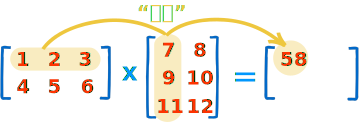

# 7.1 数学基础

大家好，我是小鱼。本节我们来学习一下线性代数的基础中的矩阵部分，矩阵作为我们学习机器人学中最常用的基础知识，后面学习过程中我们会经常遇到，比如：表示旋转的旋转矩阵、坐标变换中的齐次矩阵、关节速度映射雅可比矩阵、仿真中的惯性矩阵等等。所以很有必要在正式学习之前，了解一下矩阵的概念及常用的矩阵定义。

## 1.矩阵介绍

### 1.1 矩阵定义

由$m*n$个数$a_{ij}(i=1,2,..,m;j=1,2...,n)$排成的m行n列的矩阵表格
$$
\begin{bmatrix}
{a_{11}}&{a_{12}}&{\cdots}&{a_{1n}}\\
{a_{21}}&{a_{22}}&{\cdots}&{a_{2n}}\\
{\vdots}&{\vdots}&{\ddots}&{\vdots}\\
{a_{m1}}&{a_{m2}}&{\cdots}&{a_{mn}}\\
\end{bmatrix}
$$
称为一个$m*n$的矩阵,记为为$A$或$(a_{ij})_{m*n}(i=1,2,..,m;j=1,2...,n)$，当$m=n$时称$A$为$n$阶方阵.

> 矩阵就是一堆可能存在着某种联系数的组合，编号规则也很简单，第一行第一列的数编号为$a_{11}$,第二行第一列叫做$a_{21}$，以此类推

如果两个矩阵都是m*n个数组成，则称两个矩阵为同型矩阵。

### 1.2 零矩阵

所谓零矩阵，就是矩阵中每个数都是$0$,比如一个$3*3$的$0$矩阵（零矩阵常用$O$来表示）
$$
O_{3*3} =\begin{bmatrix}{0}&{0}&{0}\\{0}&{0}&{0}\\{0}&{0}&{0}\\\end{bmatrix}
$$

零矩阵是不是和自然数零一样神奇呢？

根据矩阵的运算法则，零矩阵有以下性质，下一节我们会来动手验证。

- 任何矩阵（前提符合运算法则）与零矩阵相加、减结果都是其本身
  $$
  A-O=A \\
  A+O=A
  $$

- 零矩阵与任何矩阵的相乘结果都是零矩阵（注意，矩阵型号可能会变）

### 1.3 单位矩阵

主对角线上的元素都为$1$，其余元素全为$0$的$n$阶矩阵称为$n$阶单位矩阵,常用符号$I$表示，如$I3$
$$
I_{3} =\begin{bmatrix}{1}&{0}&{0}\\{0}&{1}&{0}\\{0}&{0}&{1}\\\end{bmatrix}
$$

单位矩阵的性质与自然数1相似

根据矩阵的运算法则，单位矩阵有以下性质：

任何矩阵与单位矩阵的乘积结果为其本身
$$
AI_n = A\\
I_nB = B
$$

## 2.矩阵的运算

### 2.1加减法运算

**两个矩阵相加减，即其对应元素相加减。**

设矩阵
$$

A=\begin{bmatrix}
{a_{11}}&{a_{12}}&{\cdots}&{a_{1n}}\\
{a_{21}}&{a_{22}}&{\cdots}&{a_{2n}}\\
{\vdots}&{\vdots}&{\ddots}&{\vdots}\\
{a_{m1}}&{a_{m2}}&{\cdots}&{a_{mn}}\\
\end{bmatrix},B=\begin{bmatrix}
{b_{11}}&{b_{12}}&{\cdots}&{b_{1n}}\\
{b_{21}}&{b_{22}}&{\cdots}&{b_{2n}}\\
{\vdots}&{\vdots}&{\ddots}&{\vdots}\\
{b_{m1}}&{b_{m2}}&{\cdots}&{b_{mn}}\\
\end{bmatrix}
$$
有

$$

A\pm\;B=\begin{bmatrix}
{a_{11}\pm\;b_{11}}&{a_{12}\pm\;b_{12}}&{\cdots}&{a_{1n}\pm\;b_{1n}}\\
{a_{21}\pm\;b_{21}}&{a_{22}\pm\;b_{22}}&{\cdots}&{a_{2n}\pm\;b_{2n}}\\
{\vdots}&{\vdots}&{\ddots}&{\vdots}\\
{a_{m1}\pm\;b_{m1}}&{a_{m2}\pm\;b_{m2}}&{\cdots}&{a_{mn}\pm\;b_{mn}}\\
\end{bmatrix}
$$
> **只有两个矩阵为同型矩阵时才能进行加减运算。**

**运算性质**

- 交换律：$A+B=B+A$

- 结合律：$(A+B)+C=A+(B+C)$

**栗子：**

$$
A=\begin{bmatrix}{1}&{0}&{1}\\{1}&{0}&{0}\\{0}&{0}&{1}\\\end{bmatrix},B=\begin{bmatrix}{0}&{0}&{1}\\{1}&{0}&{0}\\{0}&{0}&{1}\\\end{bmatrix}\\
A+B= B+A =\begin{bmatrix}{1}&{0}&{2}\\{2}&{0}&{0}\\{0}&{0}&{2}\\\end{bmatrix}
$$

### 2.2乘法运算

乘法运算分为两种，一种是标量乘法，一种是矩阵乘法。

#### 2.2.1 标量乘法

标量乘法即一个矩阵和一个数相乘。运算法则：将矩阵的每一个元素都乘上这个数即可

**栗子：**

$$
A = \begin{bmatrix}{1}&{2}\\{3}&{4}\\\end{bmatrix}\\
2\times A= 2\times \begin{bmatrix}{1}&{2}\\{3}&{4}\\\end{bmatrix} = \begin{bmatrix}{2 \times 1}&{2 \times 2}\\{2 \times 3}&{2 \times 4}\\\end{bmatrix} =\begin{bmatrix}{2}&{4}\\{6}&{8}\\\end{bmatrix}
$$

#### 2.2.2 矩阵运算

##### 运算法则

设矩阵$A\times B = C = (c_{ij})_{m*n}$，则$C$的第$i$行第$j$列的元素$c_{ij}$的值等于矩阵A的第$i$行元素和矩阵B的第$j$列元素两两乘积之和。

**栗子：**

设：
$$
A = \begin{bmatrix}{1}&{2}\\{3}&{4}\\\end{bmatrix}, B = \begin{bmatrix}{1}&{0}\\{0}&{3}\\\end{bmatrix} \\
$$
则
$$
A \times B = C = \begin{bmatrix}{c_{11}}&{c_{12}}\\{c_{21}}&{c_{22}}\\\end{bmatrix} \\
c_{11} =1*1+2*0 = 1 \\
c_{12} =1*0+2*3 = 6 \\
c_{21} = 3*1+4*0 = 3 \\
c_{22} = 3+0 + 4*3 = 12 \\
C = \begin{bmatrix}{1}&{6}\\{3}&{12}\\\end{bmatrix}
$$

> 乘积之和其实就是点乘运算，比如栗子：
> $$
> a = [1,2,3],b = [0,1,2]\\
> a\cdot b =1*0+2*1+3*2 = 8
> $$
> 放一张摘抄的图片形象图片：
>
> 
> 矩阵的乘法的意义是非常有意思的，这里放一个链接，欢迎大家阅读：[ 矩阵乘法的本质是什么？](https://www.zhihu.com/question/21351965)

##### 运算性质

尝试计算下上面栗子中的$B\times A$的值，得到的结果依然是上面栗子中的$C$吗?

答案：并不是，一般情况下，矩阵的乘法并不满足交换律

矩阵的运算规律：

- 结合律
  $$
  (A\times B)\times C = A \times(B\times C)
  $$
  
- 分配律
  $$
  A\times(B+C) = A\times B + A\times C
  $$

### 2.4转置运算

转置运算定义非常简单，将矩阵的对应行列元素互换(左上角加${T}$表示）
$$
C = \begin{bmatrix}{c_{11}}&{c_{12}}\\{c_{21}}&{c_{22}}\\\end{bmatrix} ,C^{T} =  \begin{bmatrix}{c_{11}}&{c_{21}}\\{c_{12}}&{c_{22}}\\\end{bmatrix} \\
$$
**栗子：**
$$
A = \begin{bmatrix}{1}&{2}\\{3}&{4}\\\end{bmatrix},A^T = \begin{bmatrix}{1}&{3}\\{2}&{4}\\\end{bmatrix}
$$
**运算规律**
$$
(A^T)^T = A \\ 
(A+B)^T = A^T + B^T \\
(AB)^T = B^TA^T
$$

## 3.重要定义

### 3.1 矩阵的逆

#### 3.1.1 定义
$A,B$是n阶方阵，E是n阶单位矩阵，若$AB=BA=E$,则称$A$是可逆矩阵，并称B是A的逆，且逆矩阵是唯一的，记作$A^{-1}$

这个我们本节课就不举栗子了，下节课我们使用代码来直接求。

> 注意：不一定所有的矩阵都是可逆的

#### 3.1.2 运算规律

$$
(A^{-1})^{-1} = A \\
AB可逆，(AB)^{-1}=B^{-1}A^{-1}
$$

## 4.总结

本节主要介绍了下矩阵的定义的一些性质，还有很多需要补充的，由于时间原因先发一下文章，小鱼要去录课了

