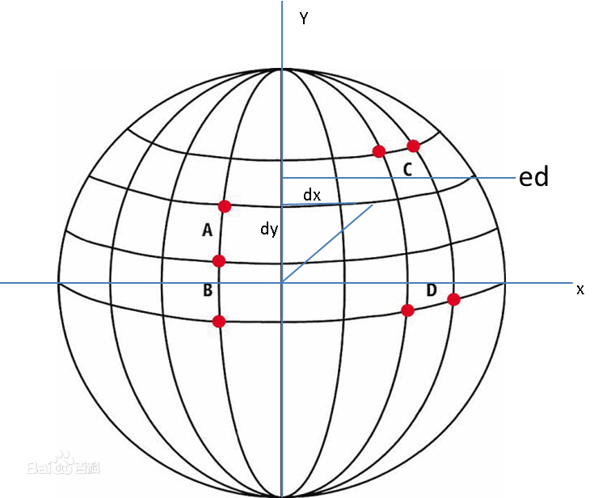
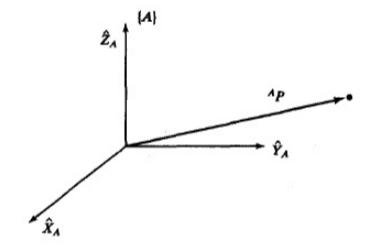
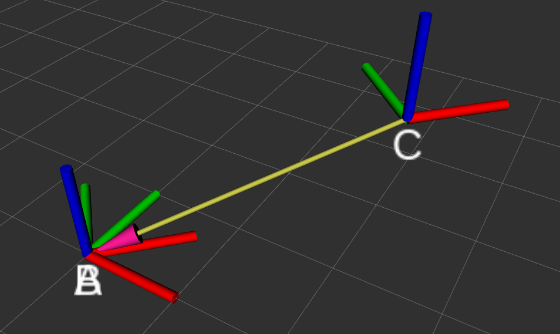
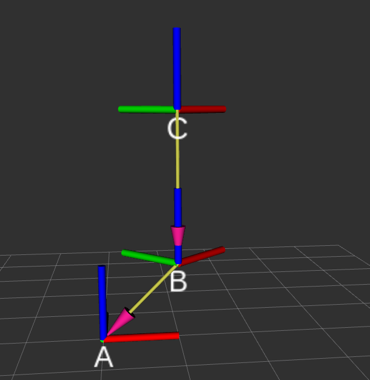
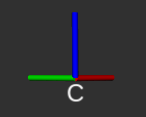
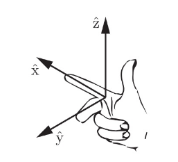

# 7.2.1 空间坐标描述

## 1.何为位姿

### 1.1 引言

在书籍《天才在左，疯子在右》中有这样一个故事，有一位十七岁的少年，他对量子力学有着独特的见解和远超同龄人的知识储备，他说四维生物突破了时空的界限，在它的观察中，人类的一生的活动连线起来，就像一条长长的虫子，它可以看到人的过去，也可以看到人的未来。

我们对四维空间不了解，但对三维立体和二维的平面每天都有接触。一张铺平的中国地图是二维平面的，拔地而起的高楼大厦是三维立体的。

那我们如何用数字表示高楼在地图中的位姿呢？又如何用数字表示某个高楼中你的位姿呢？

### 1.2 我们先来看地图中高楼的位姿

在地图上，我们可以利用经纬度坐标系来描述位姿，在经纬度坐标系中，我们可以使用经度值和纬度值表示地图上的某一个大楼的坐标，比如天安门的经纬度`经度：116.38 ，纬度：39.90`

经纬度坐标系是以经纬度原点（几内亚湾）建立二维平面直角坐标系，我们就可以使用x,y来描述该坐标系中的任意一个点的位置。

> 经度的起点就是指0度经线，位于英国格林尼治天文台旧址。 纬度的起点就是指0度纬线，就是指赤道。而经度0和纬度0的交点，大致位于非洲西部的几内亚湾，位于海上。
>
> 

通过经纬度可以定位到地图中的建筑物的位置，但我们依然无法得知这个建筑物的朝向（东南西北），所以除了描述位置的经纬度外，我们还需要增加一个theta($\theta$),表示朝向。这样我们就得到了一个物体在二维平面中用数学描述的三个值，经度（x）、维度（y） 和 朝向（theta）。

### 1.3 高楼中你的位姿

现实世界是三维的，除了经纬度还有海拔高度。所以采用经度（x）、维度（y）并不能完整的描述出空间中物体的位置，只有经纬度无法表示你所处的楼层的海拔高度，这样就没办法确定你的位置。

我们同样可以在经纬度原点建立一个三维空间直角坐标系，采用经度（x）、维度（y）和海拔高度（z）三个值来描述三维空间中任意一点的位置。

和二维空间中类似，知道了你在某一个大楼中的位置还不够，并不能判断出你的姿态（躺平的、站着的还是侧卧的），那我们该如何描述三维空间中的姿态呢? 

答案是旋转矩阵，旋转矩阵是什么？我们接着往下看。

### 1.4 参考坐标系

无论是在二维空间还是在三维空间，我们想要描述一个物体的位置和姿态第一步就是确定一个参考坐标系，物体的位置和姿态描述我们都是以这个坐标系作为参考的。

> 参考坐标系，这一点很重要，因为没有绝对的坐标，只有相对的坐标。

## 2.位置的表示

从第一节背景中可以得知，二维平面中的位置可以用$x,y$表示，三维空间中的位置的表示可以用$x,y,z$来表示。

无论是在三维空间还是在二维平面，我们都可以使用$x,y,z$来表示位置，只不过对于二维空间来说，z的值是默认的一个固定不变的值，比如$0$

假如我们确定了一个空间直角坐标系A,我们就可以使用$x,y,z$来确定A坐标系中空间中任意一点P的位置，可以记作${^A}P$

$$
{^A}P=
\begin{bmatrix}
x \\
y \\ 
z  \\
\end{bmatrix}
$$

### 2.1 位置矢量

直角坐标系{A}其实可以看作由一个三个互相正交（两两垂直）的单位矢量组成的。 那么在坐标系{A}中的一点P也可以写作矢量形式，其矢量形式由其在三个单位矢量上的分量组成。

所以参考坐标系{A}中一点P也可以写作
$$
{^A}P=
\begin{bmatrix}
{^x}p \\
{^y}p \\ 
{^z}p  \\
\end{bmatrix} = [{^x}p，{^y}p , {^z}p  ]^T
\tag{位置矢量}
$$

如果说位置矢量不太好理解，可以简单的认为就是坐标轴的$x,y,z$

$$
\begin{bmatrix}{x}\\{y}\\{z}\\\end{bmatrix}
$$

## 3.姿态的表示

在背景中小鱼提到了除了位置，坐标描述还有另外一个非常重要的组成部分——姿态。

接着上面的说，我们已经直到坐标系A中的一个点P的位置，我们如何描述P点在{A}坐标系下的姿态呢？

我们可以以P点为原点再建立一个坐标系(也可以认为该坐标系固定在物体P点上)，这样我们就可以通过描述**新坐标系{P}**和**参考坐标系{A}**之间的姿态关系来表示${^A}P$点的姿态。

> 上图使用RVIZ2绘制出的，红色代表x轴，绿色代表y轴，蓝色代表z轴。

从图中可以看出，坐标系{P}的每一个轴和参考坐标系的每一个轴之间都有一个角度，比如Px轴和Ax,Ay,Az三个轴之间存在三个角度，通过这三个角度我们就可以确定Px轴和参考坐标系{A}之间的关系，以此类推，我们也可以确定，Py轴和Pz轴和{A}之间的关系。

每个轴的相对姿态关系确定了，坐标系之间的姿态也就确定了，${^A}P$点的姿态也就确定了。

### 3.1 旋转矩阵

我们将上述坐标系{P}的三个轴相对与参考坐标系{A}三个轴的共九个角度的余弦值，组成3*3的矩阵，该矩阵就是旋转矩阵,因该矩阵是{P}相对于{A}之间的姿态关系的表示，故记作${^A_P}R$
$$
{^A_P}R=[{^A}x_{P} \ {^A}y_{P} \ {^A}z_{P}] = \begin{bmatrix}{r_{11}}&{r_{12}}&{r_{13}}\\{r_{21}}&{r_{22}}&{r_{23}}\\{r_{31}}&{r_{32}}&{r_{33}}\\\end{bmatrix} \tag{旋转矩阵}
$$

两个向量的点乘为两个向量的长度与它们夹角余弦的积,所以$r11$可以表示为向量$P_{x}$与$A_{x}$的点积，旋转矩阵就可以写为下面的形式

$$
{^A_P}R = \begin{bmatrix} 
{P_{x}\cdot A_x} & {P_{y}\cdot A_x} & {P_{z}\cdot A_x}\\
{P_{x}\cdot A_y} & {P_{y}\cdot A_y} & {P_{z}\cdot A_y}\\
{P_{x}\cdot A_z} & {P_{y}\cdot A_z} & {P_{z}\cdot A_z}\\
\end{bmatrix}
$$

将${^A_P}R$进行转置可得${^A_P}R^T$

$$
{^A_P}R^T = \begin{bmatrix} 
{P_{x}\cdot A_x} & {P_{x}\cdot A_y} & {P_{x}\cdot A_z}\\
{P_{y}\cdot A_x} & {P_{y}\cdot A_y} & {P_{y}\cdot A_z}\\
{P_{z}\cdot A_x} & {P_{z}\cdot A_y} & {P_{z}\cdot A_z}\\
\end{bmatrix}
$$

可以看出${^A_P}R^T$其实表示`坐标系{P}`作为参考坐标系下`坐标系{A}`的姿态，即
$$
{^A_P}R^T = {^P_A}R = {^A_P}R^{-1}
$$

需要注意的是：

- 当两个坐标系之间姿态没有变化，即坐标系间$x,y,z$轴方向对应重合，则旋转矩阵为单位矩阵，这个很好求得，有兴趣的同学可以算一下
- 从矩阵的角度看，矩阵的逆等于矩阵的转置，则该矩阵为正交矩阵，显而易见，旋转矩阵是正交矩阵

## 4.位置+姿态

通过位置矢量我们可以描述一个点在特定参考坐标系下的位置，通过旋转矩阵可以描述一个点在特定参考坐标系下的姿态。

在机器人当中位置和姿态一般会一起出现，所以我们将其组合就叫做`位姿`

#### 4.1 位姿描述的多个含义

- 含义1：表示特定参考坐标系下某个物体（点）的位置和姿态，比如我们描述参考坐标系{A}中物体（点）P的位置和姿态

- 含义2：表示两个坐标系之间的位姿关系，比如位置可以表示坐标系{A}和坐标系{B}原点位置关系，姿态可以表示两个坐标系坐标轴的朝向关系

    坐标系之间关系,$^AP_{Bo}$两坐标系原点之间位置矢量
    $$
    {B} = \{ ^A_BR, {^A}P_{Bo} \}
    $$

- 含义3：两个物体之间的关系，我们通常把坐标系固定在物体上，这样就可以表示两个物体之间的位姿关系，比如自行车前轮和后轮的关系

**小鱼说：学会了位置和姿态描述，三维空间坐标关系描述相信已经难不倒你了**

## 5.坐标变换

位姿是相对的，同一个物体在不同的参考坐标系下的位姿数据肯定是不同的。在后续的学习和使用当中，我们会经常需要求同一个点在不同坐标系的位姿表示，这就要求我们掌握坐标变换的方法了。

比如在手眼系统中，我们可以通过视觉算法获取到`工件坐标系P`鱼`相机坐标系C`之间的关系，我们想要控制`机械臂的末端`运动到`工件坐标系P`进行夹取，那么我们就要知道`工件坐标系P`在`机器人基坐标系B`下的位姿，如何获取呢？这就需要坐标进行变换了。

### 5.1 平移坐标变换

如图，坐标系{A}、{B}、{C}的姿态是相同的，其之间的姿态对应的旋转矩阵都是单位矩阵。在我们已知:

- {A}为参考坐标系，{B}的位置矢量${^A_B}P=[1,1,1]^T$
- {B}为参考坐标系，{C}的位置矢量${^B_C}P=[3,0,1]^T$

求：

- {A}为参考坐标系，{C}的位置矢量${^A_C}P$

大家可以利用简单的几何知识手算一下，再继续往下看

正确的答案应该是：
$$
{^A_C}P=[4,1,2]^T
$$
算法也很简单，直接将${^A_B}P$鱼${^B_C}P$相加即可
$$
{^A_C}P ={^A_B}P+{^B_C}P=[1,1,1]^T+[3,0,1]^T=[4,1,2]^T
$$
由此我们可以得出平移坐标变换可以求出同一个点（{P}）在相同姿态不同位置坐标系({A}鱼{B})下的不同表示,也可以得到坐标的平移方程
$$
{^A_C}P ={^A_B}P+{^B_C}P \tag{坐标平移方程}
$$
小鱼说需要注意的是：在上述例子中，{A},{B},{C}三个坐标系的姿态都是相同的，所以${^A_C}R={^A_B}R={^B_C}R$，也都是是单位旋转矩阵

### 5.2 旋转坐标变换

如果坐标系之间姿态不同，同一个点的位姿在不同参考姿态下的位置和姿态也会不一样。

上图中，坐标系{A}鱼坐标系{B}原点重合（连名字都连一块了），我们已知：

- {B}坐标系绕{A}的z轴即$A_z$旋转了$45^\circ$
- {B}鱼{C}姿态相同，{B}为参考坐标系，{C}的位置矢量为${^B_C}P=[3,0,1]^T$

求

- {A}为参考坐标系,{C}的位置矢量${^A_C}P$
- {A}为参考坐标系,{C}的旋转矩阵${^A_C}R$

这次相对来说有一些困难，不过我们依然可以手推出来,接着和小鱼的思路一起走一下

#### 5.2.1 求${^A_C}R$

因为{B}鱼{C}姿态相同，所以{A}参考坐标系下{C}的姿态和{A}参考坐标系下{B}的姿态是相同的，即：
$$
{^A_B}R={^A_C}R
$$
接着只需要求${^A_B}R$即可，因为{B}坐标系绕{A}的z轴即$A_z$旋转了$45^\circ$,我们可以一一计算旋转矩阵各个元素的值
$$
{^A_B}R ={^A_C}R = \begin{bmatrix} 
{B_{x}\cdot A_x} & {B_{y}\cdot A_x} & {B_{z}\cdot A_x}\\
{B_{x}\cdot A_y} & {B_{y}\cdot A_y} & {B_{z}\cdot A_y}\\
{B_{x}\cdot A_z} & {B_{y}\cdot A_z} & {B_{z}\cdot A_z}\\
\end{bmatrix}
= \begin{bmatrix} 
{cos(45)} & cos(90+45) & cos(90)\\
{cos(90-45)} & cos(45) & cos(90)\\
{cos(90)} & cos(90) & cos(0)\\
\end{bmatrix}
= \begin{bmatrix} 
{cos(45)} & cos(90+45) & 0\\
{cos(90-45)} & cos(45) & 0\\
{0} &0 &1\\
\end{bmatrix}
$$
将结果在出来，再利用[工具](https://www.andre-gaschler.com/rotationconverter/)来算一下，看看最终结果对不对

到此我们求出了${^A_C}P$鱼${^A_C}R$，但聪明的鱼粉肯定不会就此罢休，我们接着来举一反三

{B}绕着{A}的z轴旋转了45度我们计算出来了，那如果{B}绕着{A}旋转$\theta$角度该如何呢?相信聪明的鱼粉心中已经有了答案
$$
R(z,\theta)= \begin{bmatrix} 
{cos\theta} & -sin\theta & 0\\
{sin\theta} & cos\theta & 0\\
{0} &0 &1\\
\end{bmatrix} \tag{小鱼提示：重要方程1}
$$
那如果不是绕着z轴旋转，而是绕着x轴呢？
$$
R(x,\theta)= \begin{bmatrix} 
1 & 0           &          0\\
0 & {cos\theta} & -sin\theta \\
0&{sin\theta} & cos\theta \\

\end{bmatrix} \tag{小鱼提示：重要方程2}
$$
绕着y轴呢？
$$
R(y,\theta)= \begin{bmatrix} 
{cos\theta} & 0 & {sin\theta}\\
0 &1 &0\\
{-sin\theta} & 0 &cos\theta \\

\end{bmatrix} \tag{小鱼提示：重要方程3}
$$

#### 5.2.2 求$^A_CP$

现在我们已知$^B_CP$和$^A_BR$,那如何求$^A_CP$呢，我们可以使用下面这个方程
$$
^A_CP = {^A_BR}{^B_CP}\tag{坐标旋转方程}
$$
关于这个方程，其实是将$^B_CP$在{B}上各轴的分量变换到了{A}的各轴上

${^A_BR}$是一个$3*3$的矩阵，${^B_CP}$是$3*1$的矩阵，其相乘结果还是一个$3*1$的矩阵，利用前几节学习的矩阵乘法手算或者使用numpy进行计算，得到最终结果为：
$$
^A_CP = {^A_BR}{^B_CP}\ = [2.12,2.12,1]^T
$$

> 小思考:{C}的参考坐标系从{B}变成了{A},{C}在空间中的位置发生了变化了吗？

### 5.3平移旋转复合变换

在我们平时搞机（器人）时，一般情况下两个坐标系原点不重合姿态也不相同。我们将坐标变换拆分成先绕参考坐标系旋转，再绕参考坐标系平移两步，这样我们就得到了坐标的复合变换方程
$$
^A_CP = {^A_BR}{^B_CP}+^A_BP
$$
这个公式其实也很好理解，${^A_BR}{^B_CP}$就是将{C}在{B}上的各轴分量转换到{A}上，再和原来在{A}上各轴的分量再相加。不理解的同学也没事，后面我们使用最多的还是齐次变换矩阵，根据方程直接摝代码就行了。

## 6.左手还是右手

最后小鱼要说的是左手坐标系和右手坐标系，一般情况下我们都是使用右手坐标系搞机。

用右手确定的坐标系就是右手坐标系了，跟着小鱼一起做：

拿起你的右手，先给自己竖个大拇指，然后打开手掌，将大拇指的方向朝向下图中的蓝色z轴，让剩下的四根手指朝向红色的x轴，此时朝向手心外的就是绿绿的y轴的方向了。

如果你换左手，做上述动作，你会发现y轴是朝手心里的。

再放张图给肢体不协调的同学：

## 7.练习

光说不练假把式，我们来做个手眼转换题

#### 如图🔓示，已知：

1.相机坐标系{C}为参考坐标系，工具坐标系{P}的位置矢量在相机坐标系{C}`x,y,z`各轴投影为$2,1,2$，并且工具坐标系和相机坐标系姿态相同。

2.机器人基坐标系{B}为参考坐标系，相机坐标系{C}在的位置矢量在{B}各轴的投影为$0,0,3$,坐标系{C}和绕着坐标系{B}的x轴转了180度

可以参考下图看题目

#### 求：

**{B}为参考坐标系，坐标系{P}的位置矢量和旋转矩阵**

**答案：**

位置矢量：
$$
[2,-1,1]^T
$$

旋转矩阵：
$$
\begin{bmatrix} 
1 & 0 & 0\\
0 & -1 & 0\\
0 &0 & -1\\
\end{bmatrix}
$$

**参考文档**

- 机器人学导论
- 机器人学基础

--------------

技术交流&&问题求助：

- **微信公众号及交流群：鱼香ROS**
- **小鱼微信：AiIotRobot**
- **QQ交流群：139707339**
- 版权保护：已加入“维权骑士”（rightknights.com）的版权保护计划

