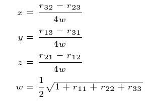

# 姿态的不同表示

大家好，我是小鱼，本节课，我们来学习姿态的多种表示方式。在前面的课程中，我们一共接触了三种姿态的表示方式：

1. 旋转矩阵-在位姿描述一节中
2. 坐标轴旋转-绕xyz轴旋转不同的角度(欧拉角)
3. 四元数-ROS2的TF2中的姿态描述

本节小鱼将对以上的三种姿态描述进行归类与介绍，并对他们之间的转换方法进行讲解，下一节小鱼带你一起通过代码直观的观察和操作姿态变换。

小鱼将常用的坐标描述分为三类，共五种。这五种也是小鱼在平时工作中所接触到的几乎所有姿态描述方法，三类共五种方法如下：

- 旋转矩阵-`旋转矩阵`
- 坐标轴旋转-`固定轴欧拉角`,`非固定轴欧拉角`
- 任意轴旋转-`等效轴角`,`四元数`

常用的坐标转换包括：

- `固定角`与`四元数`互转
- `固定角`与`旋转矩阵`互转
- `四元数`与`旋转矩阵`互转

## 1.旋转矩阵

关于旋转矩阵我们在前几节教程中已经介绍了，旋转矩阵采用的是`旋转后的坐标系`三个轴分别与`原坐标系`三个轴的夹角余弦值共九个数字组成3*3的矩阵。

旋转矩阵一般记作记作$R$ 

> 若两个坐标系姿态相同，其旋转矩阵为单位矩阵。

### 1.1 旋转矩阵的描述

如图，描述`坐标系{P}`和`参考坐标系{A}`之间的姿态关系来表示${^A_P}R$点的姿态。

$$
{^A_P}R=[{^A}x_{P} \ {^A}y_{P} \ {^A}z_{P}] = \begin{bmatrix}{r_{11}}&{r_{12}}&{r_{13}}\\{r_{21}}&{r_{22}}&{r_{23}}\\{r_{31}}&{r_{32}}&{r_{33}}\\\end{bmatrix} \tag{旋转矩阵}
$$

两个向量的点乘=两个向量的长度(1)与它们夹角余弦的积,所以$r11$可以表示为向量$P_{x}$与$A_{x}$的点积，旋转矩阵就可以写为下面的形式

$$
{^A_P}R = \begin{bmatrix} 
{P_{x}\cdot A_x} & {P_{y}\cdot A_x} & {P_{z}\cdot A_x}\\
{P_{x}\cdot A_y} & {P_{y}\cdot A_y} & {P_{z}\cdot A_y}\\
{P_{x}\cdot A_z} & {P_{y}\cdot A_z} & {P_{z}\cdot A_z}\\
\end{bmatrix}
$$

### 1.2 绕某一轴旋转$\theta$转旋转矩阵

`新的坐标系`绕`原坐标系`某一坐标轴旋转任意角度得到的旋转矩阵有如下等式。

#### 绕x轴旋转$\theta$后姿态矩阵
$$
R(x,\theta)= \begin{bmatrix} 
1 & 0           &          0\\
0 & {cos\theta} & -sin\theta \\
0&{sin\theta} & cos\theta \\
\end{bmatrix}
$$

#### 绕y轴旋转$\theta$后姿态矩阵
$$
R(y,\theta)= \begin{bmatrix} 
{cos\theta} & 0 & {sin\theta}\\
0 &1 &0\\
{-sin\theta} & 0 &cos\theta \\
\end{bmatrix}
$$

#### 绕z轴旋转$\theta$后姿态矩阵
$$
R(z,\theta)= \begin{bmatrix} 
{cos\theta} & -sin\theta & 0\\
{sin\theta} & cos\theta & 0\\
{0} &0 &1\\
\end{bmatrix} 
$$

## 2.欧拉角-绕坐标轴的旋转

### 2.1 12种旋转顺序
旋转矩阵是一个冗余的（九个值之间存在约束关系），可以只需要三个参数来表示旋转矩阵。聪明的鱼粉肯定会想到，假如知道坐标系绕分别绕X、Y、Z轴的旋转角度，不就同样可以表示旋转了吗？

这个猜想是对的，结合1.2中的绕三个轴的旋转的三个$\theta$，按照特定的顺序将对应的旋转矩阵乘起来就可以确定一个旋转矩阵。

但需要注意的是，矩阵的乘法不具备交换性，所以旋转顺序不同会造成不同的结果。

比方说若是先绕自身$x$轴旋转$\alpha$，再绕自身$y$轴旋转$\beta$：

$$
R(x,\alpha)R(y,\beta)=
\begin{bmatrix} 
1 & 0           &          0\\
0 & {cos\alpha} & -sin\alpha \\
0&{sin\alpha} & cos\alpha \\
\end{bmatrix}
\begin{bmatrix} 
{cos\beta} & 0 & {sin\beta}\\
0 &1 &0\\
{-sin\beta} & 0 &cos\beta 
\end{bmatrix}=
\begin{bmatrix} 
{cos\beta} & 0 & {sin\beta}\\
sin\alpha sin\beta &cos\alpha & -sin\alpha cos\beta\\
{-cos\alpha sin\beta} & sin\alpha &cos\alpha cos\beta \\
\end{bmatrix}
$$

比方说若是，先绕自身$y$轴旋转$\beta$，绕自身$x$轴旋转$\alpha$：

$$
R(y,\beta)R(x,\alpha)=
\begin{bmatrix} 
{cos\beta} & 0 & {sin\beta}\\
0 &1 &0\\
{-sin\beta} & 0 &cos\beta \\
\end{bmatrix}
\begin{bmatrix} 
1 & 0           &          0\\
0 & {cos\alpha} & -sin\alpha \\
0&{sin\alpha} & cos\alpha \\
\end{bmatrix}=
\begin{bmatrix} 
cos\beta   & sin\alpha sin\beta  & {sin\beta}\\
0 & {cos\alpha} & -sin\alpha \\
{-sin\beta} & sin\alpha &cos\alpha sin\beta \\
\end{bmatrix}
$$

所以我们对旋转顺序做排列组合，可以得到12种旋转顺序:
- `xyz`,`xyx`, `xzy`
- `xzx`,`yzx`, `yzy`
- `yxz`, `yxy` , `zxy`
- `zxz`, `zyx`, `zyz`

### 2.2 两种参考坐标系
**除了要考虑旋转时所绕轴的顺序，还要考虑参考坐标系（坐标轴）的不同。**

#### 2.2.1 参考固定的坐标系

假设坐标系B鱼坐标系A初始姿态相同

- 坐标系{B}绕坐标系A的x轴`Ax`旋转$\alpha$
- 接着坐标系{B}绕着A的y轴`Ay`旋转$\beta$
- 接着绕`Az`旋转$\gamma$

上述三次旋转中，旋转时都是绕着A坐标系的xyz轴为参考坐标系，该旋转方式成为固定旋转轴的旋转，称之为固定角欧拉角或固定轴旋转。

#### 2.2.2 参考自身坐标系

我们也可以不沿着坐标系A的各轴旋转，而是绕旋转之后B的某一轴再次旋转，我们称之为非固定旋转轴的欧拉角。

> 小鱼说:无论是参考自身坐标系还是参考固定的坐标系，都有12种旋转方式，所以欧拉角有12*2=24种旋转方式，后面的计算中我们也直观的感受到24种旋转方式的不同。

### 2.3 固定转轴欧拉角 转 旋转矩阵
首先我们来考虑绕固定的坐标系旋转如何转换成旋转矩阵

我们以顺序XYZ来举例说明，其他旋转顺序类似

现在假设A、B两个坐标系重合，B坐标系绕A坐标系的X轴旋转45度，绕A的Z轴旋转90度.

求旋转之后A为参考坐标系，B坐标系的姿态$^A_BR_{XYZ(45,0,90)}$

小鱼先告诉你最终的结果：
$$
^A_BR_{XYZ(45,0,90)}=R_{Z(90)}R_{Y(0)}R_{X(45)}=R_{Z(90)}R_{X(45)}=\begin{bmatrix} 
0.&-0.70710678 & 0.70710678\\
-1&0&0\\ 
0&0.70710678&0.70710678\\
\end{bmatrix}
$$

为什么结果是将绕Z轴的旋转矩阵乘绕X轴的旋转矩阵呢？

这里引用林沛群老师的解释：

我们可以假设一个向量v固定在B坐标系上，那我们让B坐标系绕着A坐标系的三个轴做旋转，就可以认为是让向量v绕着坐标系A的三个轴做旋转，那先转的肯定先乘，所以我们先让向量v乘上Rx(45),再让其乘上Rz(90)，即：
$$
v' = R_{Z(90)}(R_{X(45)}v)
$$
根据矩阵乘法的结合律，括号可以去掉：
$$
v' = R_{Z(90)}R_{X(45)}v
$$

所以我们可以得到，绕固定轴XYZ旋转的欧拉角转旋转矩阵方法:
$$
R_{XYZ(\gamma,\beta,\alpha)}=R_{Z(\alpha)}R_{Y(\beta)}R_{X(\gamma)}
$$
最终结果：

根据旋转顺序不同，固定角有12种旋转方式，这里我们给出了绕固定轴以XYZ顺序旋转欧拉角转旋转矩阵的等式，其他旋转顺序对应的旋转矩阵可以尝试自行推导.

### 2.2 非固定旋转轴的欧拉角

非固定旋转轴，即每次旋转是绕着自身的坐标轴进行旋转，其旋转动图如2.2.2节所示。

非固定旋转的欧拉角转旋转矩阵推导也很简单，我们以旋转顺序ZYX为例子分析

#### 2.2.1 ZYX

因为每次旋转都是绕着自身进行的，我们可以将每次的旋转进行拆解

$$
^A_BR={^A_{B'}R}{^{B'}_{B''}R}{^{B''}_{B}R}
$$

等式右边的三次旋转按照顺序Z-Y-X进行的，所以最终B坐标系在A坐标系下的姿态为：

$$
^A_BR_{Z'Y'X'}=R_{Z(\alpha)}R_{Y(\beta)}R_{X(\gamma)}
$$

最终结果太难敲，小鱼直接截图啦

> 旋转矩阵转欧拉角的方法需要使用双参变量的反正切函数，我们后面在程序当中直接调用对应函数即可实现，这里对原理就不再进行推导了

## 3.轴角
在介绍四元数之前，我们先来说说等效角度轴线，这种表示姿态的方式。

上一节欧拉角中无论是绕着自身的某个轴旋转，还是绕着固定的坐标系的某个轴进行旋转，旋转时参考的轴都是坐标系的主轴

假如我们参考的轴不是主轴，那么任何姿态都可以通过选择适当的轴和角度得到，换句话说，两个坐标系之间的任何姿态都可以通过绕某一个特定的轴(矢量)旋转特定的角度得到。

说到这里相信你已经理解了轴角的意义，接着我们给出轴角和旋转矩阵之间的转换关系

### 轴角转旋转矩阵
假设坐标系B和参考坐标系A宠儿，将B绕着A坐标系下的矢量$^AK$按右手定则旋转$\theta$角度，旋转之后B坐标系在A坐标系下的姿态可以用
$$
^A_BR(K,\theta)
$$
表示，注意矢量K为单位矢量(模场为1)，K为一个3*1的矢量
$$
^AK=[k_x,k_y,k_z]^T
$$

在已知矢量K和$\theta$的情况下，我们如何得到旋转矩阵呢?

有等式：

其中

$$
c\theta=cos\theta \\
s\theta=sin\theta \\
v\theta=1-cos\theta
$$

$\theta$的符号由右手定则确定，右手大拇指指向矢量K的方向.

旋转矩阵转轴角需要根据情况讨论，该部分转换我们直接调用相应函数实现，这里对其原理不再叙述，感兴趣的同学可以参考：https://en.wikipedia.org/wiki/Rotation_matrix#Axis_of_a_rotation

## 4.四元数

除了轴角可以使用一个表示角度和三个表示旋转轴，一共四个数字表示旋转外。还有另外一种方式可以表示旋转——四元数。

四元数的四个数字由一个实部和三个虚部组成，是一个超复数形式

$$
q = w + x*i+ y*j + z*k
$$

关于四元数的由来有个小故事，小鱼分享一下：

> 1843年10月16日的傍晚，英国数学家哈密顿和他的妻子一起步行去都柏林，途中经过布鲁哈姆桥时，他的脚步突然放慢了。妻子以为他要尽情欣赏周围的景色，于是也放慢了脚步。其实哈密顿此时正在思考他久久不能解决的问题。早在1828年，他就想发明一种新的代数，用来描述绕空间一定轴转动并同时进行伸缩的向量的运动。他设想这种新代数应包含四个分量：两个来固定转动轴，一个来规定转动角度，第四个来规定向量的伸缩。但是在构造新代数的过程中，由于他受传统观念的影响，不肯放弃乘法交换律，故屡受挫折。哈密顿盲目地相信，普通代数最重要的规律必定继续存在于他寻找的代数中。然而此刻，他的脑际突然产生了一个闪念：在所寻找的代数中，能否让交换律不成立呢？比方说，A×B不等于B×A而是等于负的B×A。这个想法太大胆了，他感到非常激动。哈密顿马上掏出笔记本，把他的思想火花记录下来。这一火花就是I，J，K之间的基本方程，即四元数乘法基本公式。哈密顿因此把1843年10月16日称为四元数的生日。此后，哈密顿一生的最后22年几乎完全致力于四元数的研究，成果发表在他去世后出版的《四元数基础》一书中。四元数的出现，推倒了传统代数的关卡，故有数学史上星程碑的美誉。后人为了纪念这一发明，特意在当年哈密顿刻划过的石头上镶嵌了一块水泥板，上面清楚地记载着1843年曾经发生的故事。

四元数在机器人中使用的非常多，甚至在量子力学中都有使用，关于四元数旋转的本质，小鱼也学习了很久才搞清楚，B站上3B1B的视频非常经典，大家自行食用。

> 在机器人学当中用到的四元数都是单位四元数（四维单位超球体在三维空间的投影）,下文中提到的四元数默认指单位四元数

<iframe height="400" width="600" src="//player.bilibili.com/player.html?aid=33385105&bvid=BV1SW411y7W1&cid=58437850&page=1" scrolling="no" border="0" frameborder="no" framespacing="0" allowfullscreen="true"> </iframe>

接着我们来说说四元数常用的转换

四元数转旋转矩阵

旋转矩阵转四元数

四元数转欧拉角

四元数转轴角

轴:$^AK=[k_x,k_y,k_z]^T$ 角:$\theta$
$$
x= k_x\sin(\theta/2)\\
y= k_y\sin(\theta/2) \\
z= k_z\sin(\theta/2)\\
w = \cos(\theta/2)
$$

>  小计算: $w^2+x^2+y^2+z^2=1$

