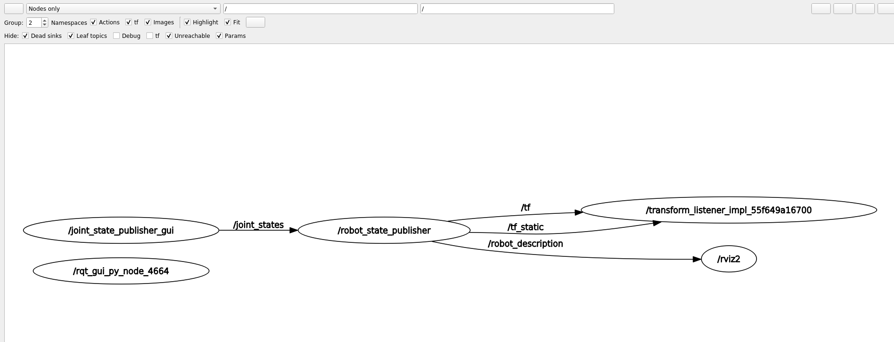
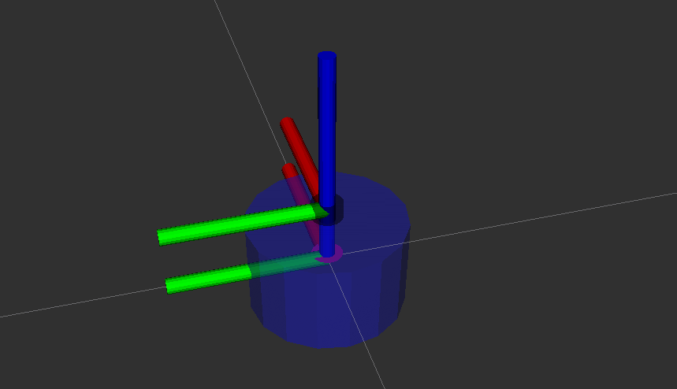
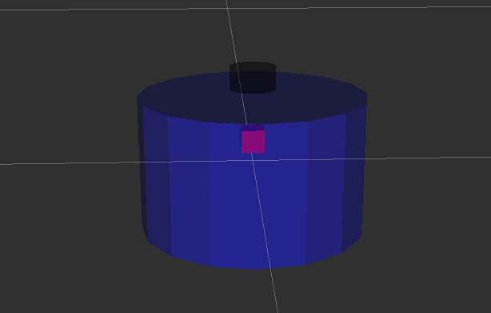

# 8.2 RVIZ2可视化移动机器人模型

大家好，我是小鱼，上一节讲完joint和link，我们来把我们上面定义的简单的URDF(包含身体和雷达)用RVIZ2显示出来，直观的感受下，我们的机器人模型。

URDF可视化的步骤如下：

1. 建立机器人描述功能包

2. 建立`urdf`文件夹编写urdf文件
3. 建立`launch`文件夹，编写launch文件
4. 修改`setup.py`配置，编译测试


## 1.建立功能包

轻车熟路，先创建一个`fishbot_ws`工作空间，然后建立功能包，包的类型选`ament_python`

```shell
ros2 pkg create fishbot_description --build-type ament_python
```


## 2.建立URDF文件

建立文件夹，创建urdf文件

```
cd fishbot_description && mkdir urdf 
touch fishbot_base.urdf
```

编辑`fishbot_base.urdf`

```xml
<?xml version="1.0"?>
<robot name="fishbot">
    
  <!-- base link -->
  <link name="base_link">
  	<visual>
      <origin xyz="0 0 0.0" rpy="0 0 0"/>
      <geometry>
		<cylinder length="0.12" radius="0.10"/>
      </geometry>
    </visual>
  </link>
    
  <!-- laser link -->
  <link name="laser_link">
  	<visual>
      <origin xyz="0 0 0" rpy="0 0 0"/>
      <geometry>
		<cylinder length="0.02" radius="0.02"/>
      </geometry>
      <material name="black">
      	<color rgba="0.0 0.0 0.0 0.8" /> 
      </material>
    </visual>
  </link>
    
  <!-- laser joint -->
    <joint name="laser_joint" type="fixed">
        <parent link="base_link" />
        <child link="laser_link" />
        <origin xyz="0 0 0.075" />
    </joint>

</robot>
```


## 3.建立launch文件

```
mkdir launch
touch display_rviz2.launch.py
```

```python
import os
from launch import LaunchDescription
from launch.substitutions import LaunchConfiguration
from launch_ros.actions import Node
from launch_ros.substitutions import FindPackageShare


def generate_launch_description():
    package_name = 'fishbot_description'
    urdf_name = "fishbot_base.urdf"

    ld = LaunchDescription()
    pkg_share = FindPackageShare(package=package_name).find(package_name) 
    urdf_model_path = os.path.join(pkg_share, f'urdf/{urdf_name}')

    robot_state_publisher_node = Node(
        package='robot_state_publisher',
        executable='robot_state_publisher',
        arguments=[urdf_model_path]
        )

    joint_state_publisher_node = Node(
        package='joint_state_publisher_gui',
        executable='joint_state_publisher_gui',
        name='joint_state_publisher_gui',
        arguments=[urdf_model_path]
        )

    rviz2_node = Node(
        package='rviz2',
        executable='rviz2',
        name='rviz2',
        output='screen',
        )

    ld.add_action(robot_state_publisher_node)
    ld.add_action(joint_state_publisher_node)
    ld.add_action(rviz2_node)

    return ld
```

想要可视化模型需要三个节点参与

- `joint_state_publisher_gui` 负责发布机器人关节数据信息，通过`joint_states`话题发布
- `robot_state_publisher_node`负责发布机器人模型信息`robot_description`，并将`joint_states`数据转换tf信息发布
- `rviz2_node`负责显示机器人的信息

```mermaid
graph
A[joint_state_publisher]--joint_states-->B
B[robot_state_publisher]--robot_de-->C
C[rviz2]

```

这里我们用到了`joint_state_publisher_gui`和`robot_state_publisher`两个包,如果你的系统没有安装这两个包,可以手动安装:

```
sudo apt install ros-$ROS_DISTRO-joint-state-publisher-gui ros-$ROS_DISTRO-robot-state-publisher
```

> `joint_state_publisher_gui`，还有一个兄弟叫做`joint_state_publisher`两者区别在与`robot_state_publisher_gui`运行起来会跳出一个界面，通过界面可以操作URDF中能动的关节

## 4.修改setup.py

导入头

```python
from glob import glob
import os
```

加入目录安装

```python
('share/ament_index/resource_index/packages',
['resource/' + package_name]),
('share/' + package_name, ['package.xml']),
```

完整

```python
from setuptools import setup
from glob import glob
import os

package_name = 'fishbot_description'

setup(
    name=package_name,
    version='0.0.0',
    packages=[package_name],
    data_files=[
        ('share/ament_index/resource_index/packages',
            ['resource/' + package_name]),
        ('share/' + package_name, ['package.xml']),
        (os.path.join('share', package_name, 'launch'), glob('launch/*.launch.py')),
        (os.path.join('share', package_name, 'urdf'), glob('urdf/**')),
    ],
    install_requires=['setuptools'],
    zip_safe=True,
    maintainer='root',
    maintainer_email='root@todo.todo',
    description='TODO: Package description',
    license='TODO: License declaration',
    tests_require=['pytest'],
    entry_points={
        'console_scripts': [
        ],
    },
)
```


## 5.编译测试

编译

```
colcon build
```

运行测试

```
source install/setup.bash
ros2 launch fishbot_description display_rviz2.launch.py
```

添加robotmodel模块，分别选择link名称如下，即可看到机器人的模型显示


此时看看节点关系图




这里大家可以参考图理一理launch文件中启动的三个节点的关系。

然后打开TF模块，看一下机器人的坐标系关系




## 6.本节练习

练习1：尝试将修改机器人身体颜色为蓝色，透明度为50%`(0.1 0.1 1.0 0.5)`

练习2：尝试在URDF中添加imu_link并使用imu_joint将其固定在车体的中心上方2cm，imu采用的几何形状为box。长宽高各是2cm


结果展示：




--------------

技术交流&&问题求助：

- **微信公众号及交流群：鱼香ROS**
- **小鱼微信：AiIotRobot**
- **QQ交流群：139707339**

- 版权保护：已加入“维权骑士”（rightknights.com）的版权保护计划
