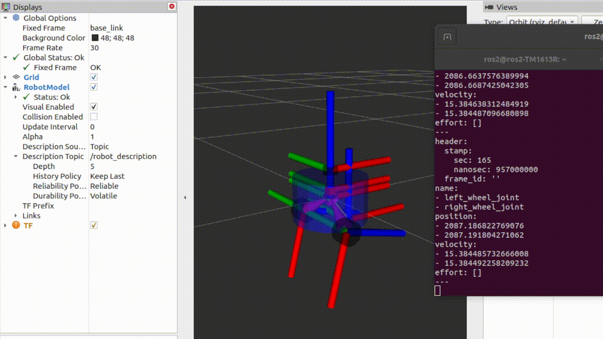

# 8.4 控制移动机器人轮子运动

我是小鱼,本节我们来看看如何手动的发送`joint_states`来控制机器人轮子连续转动




要实现上图效果，我们需要自己编写节点,取代`joint_state_publisher`发送关节位姿给`robot_state_pubsher`，robot_state_publisher发送tf控制机器人的关节转动。


1.新建节点

2.创建发布者

3.编写发布逻辑

4.编译测试

## 1.新建节点

方便起见，我们就在`fishbot_describle`包中新建节点（参考李四节点代码）

```shell
cd fishbot_ws
touch fishbot_description/fishbot_description/rotate_wheel.py
```

```python
#!/usr/bin/env python3
import rclpy
from rclpy.node import Node


class RotateWheelNode(Node):
    def __init__(self,name):
        super().__init__(name)
        self.get_logger().info("rotate node init.." % name)


def main(args=None):
    """
    ros2运行该节点的入口函数
    1. 导入库文件
    2. 初始化客户端库
    3. 新建节点
    4. spin循环节点
    5. 关闭客户端库
    """
    rclpy.init(args=args) # 初始化rclpy
    node = RotateWheelNode("rotate_fishbot_wheel")  # 新建一个节点
    rclpy.spin(node) # 保持节点运行，检测是否收到退出指令（Ctrl+C）
    rclpy.shutdown() # 关闭rclpy
```

配置下setup.py

```
    entry_points={
        'console_scripts': [
            "rotate_wheel= fishbot_description.rotate_wheel:main"
        ],
    },
```

编译运行

```
colcon build
source install/setup.bash
ros2 run fishbot_description rotate_wheel
```


## 2.创建发布者

创建发布者之前，要知道`robot_state_pubsher`所订阅的话题类型是什么？

回忆前面章节中学习的内容，我们可以采用如下指令查看

```
ros2 topic info /joint_states
```

```
Type: sensor_msgs/msg/JointState
Publisher count: 1
Subscription count: 1
```

接着

```
ros2 interfaces show sensor_msgs/msg/JointState
```

```
# This is a message that holds data to describe the state of a set of torque controlled joints.
#
# The state of each joint (revolute or prismatic) is defined by:
#  * the position of the joint (rad or m),
#  * the velocity of the joint (rad/s or m/s) and
#  * the effort that is applied in the joint (Nm or N).
#
# Each joint is uniquely identified by its name
# The header specifies the time at which the joint states were recorded. All the joint states
# in one message have to be recorded at the same time.
#
# This message consists of a multiple arrays, one for each part of the joint state.
# The goal is to make each of the fields optional. When e.g. your joints have no
# effort associated with them, you can leave the effort array empty.
#
# All arrays in this message should have the same size, or be empty.
# This is the only way to uniquely associate the joint name with the correct
# states.

std_msgs/Header header

string[] name
float64[] position
float64[] velocity
float64[] effort
```

知道了话题类型，我们就可以来创建发布者了参考代码[4.2.1 话题通信实现(Python)](https://fishros.com/d2lros2foxy/#/chapt4/4.2话题通信实现(Python))

```python
#!/usr/bin/env python3
import rclpy
from rclpy.node import Node
# 1.导入消息类型JointState
from sensor_msgs.msg import JointState

class RotateWheelNode(Node):
    def __init__(self,name):
        super().__init__(name)
        self.get_logger().info(f"node {name} init..")
        # 2.创建并初始化发布者成员属性pub_joint_states_
        self.pub_joint_states_ = self.create_publisher(JointState,"joint_states", 10) 
```


## 3.编写发布逻辑

创建好发布者，我们想让话题按照某个固定的速度进行发布，可以采用ROS2中的定时神器Rate,不清楚Rate的小伙伴可以看看小鱼的这篇文章：[ROS中的定频神器你会用吗](https://mp.weixin.qq.com/s/bFbTIh6rGou1k0Ach-hlqA)

为了能够一直循环使用rate，我们单独开一个线程用于发布joint_states话题数据


接着我们来构造发布的数据：

joint_states有一个头和四个数组需要赋值

```
std_msgs/Header header #时间戳信息
string[] name
float64[] position
float64[] velocity
float64[] effort
```

对应的含义为：

```
# 这是一个持有数据的信息，用于描述一组扭矩控制的关节的状态。
#
# 每个关节（渐进式或棱柱式）的状态由以下因素定义。
# #关节的位置（rad或m）。
# #关节的速度（弧度/秒或米/秒）和
# #在关节上施加的力（Nm或N）。
#
# 每个关节都由其名称来唯一标识
# 头部规定了记录关节状态的时间。所有的联合状态
# 必须是在同一时间记录的。
#
# 这个消息由多个数组组成，每个部分的联合状态都有一个数组。
# 目标是让每个字段都是可选的。例如，当你的关节没有
# 扭矩与它们相关，你可以让扭矩数组为空。
#
# 这个信息中的所有数组都应该有相同的大小，或者为空。
# 这是唯一能将关节名称与正确的
# 状态。
string[] name #关节名称数组
float64[] position #关节位置数组
float64[] velocity #关节速度数组
float64[] effort #扭矩数据
```

>  单个轮子的转速 = (当前的位置-上一时刻位置）/ 两个时间之间的间隔

所以最终有如下代码：


## 4.编译测试


编译程序

```
colcon build
```
此时运行关节数据发布节点

```
ros2 run 
```

测试之前还需要修改下`display_rviz2.launch.py`文件，注释其`joint_state_publisher`节点

```

```

先运行rviz和robot_state_publisher

```
source install/setup.bash
ros2 launch fishbot_description display_rviz2.launch.py
```

观察此时rviz界面


--------------

技术交流&&问题求助：

- **微信公众号及交流群：鱼香ROS**
- **小鱼微信：AiIotRobot**
- **QQ交流群：139707339**

- 版权保护：已加入“维权骑士”（rightknights.com）的版权保护计划
