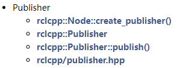
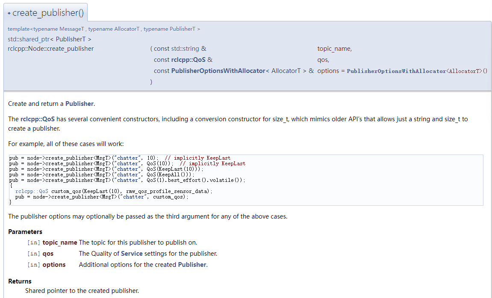
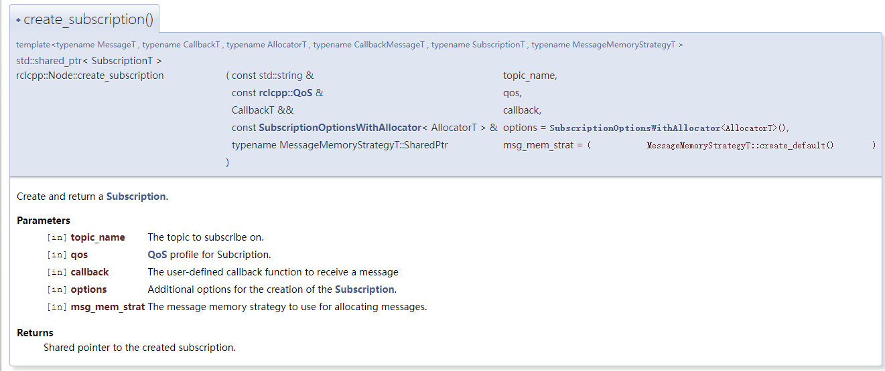
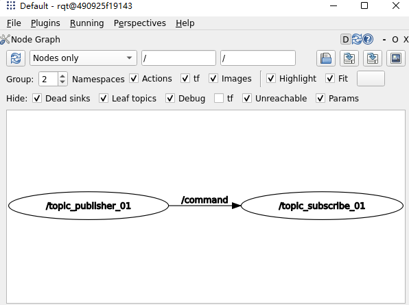

# 2.话题之RCLCPP实现

本节我们学习使用ROS2的RCLCPP客户端库来实现话题通信。

RCLCPP为Node类提供了丰富的API接口，其中就包括创建话题发布者和创建话题订阅者。

## 1.创建节点

本节我们将创建一个`控制节点`和一个`被控节点`。

控制节点创建一个话题发布者，发布控制命令（command）话题，接口类型为字符串（string），控制接点通过发布者发布控制命令（前进、后退、左转、右转、停止）。

被控节点创建一个订阅者，订阅控制命令，收到控制命令后根据命令内容打印对应速度出来。

```mermaid
graph LR;
A[控制节点]--command-->B[被控节点]
```

依次输入下面的命令，创建`chapt3_ws`工作空间、`example_topic_rclcpp`功能包和`topic_publisher_01.cpp`。

```shell
cd d2lros2/
mkdir -p chapt3/chapt3_ws/src
cd chapt3/chapt3_ws/src
ros2 pkg create example_topic_rclcpp --build-type ament_cmake --dependencies rclcpp
touch example_topic_rclcpp/src/topic_publisher_01.cpp
```

完成后目录结构

```
.
└── src
    └── example_topic_rclcpp
        ├── CMakeLists.txt
        ├── include
        │   └── example_topic_rclcpp
        ├── package.xml
        └── src
            └── topic_publisher_01.cpp

5 directories, 3 files
```

接着采用面向对象方式写一个最简单的节点。

```
#include "rclcpp/rclcpp.hpp"

class TopicPublisher01 : public rclcpp::Node
{
public:
    // 构造函数,有一个参数为节点名称
    TopicPublisher01(std::string name) : Node(name)
    {
        RCLCPP_INFO(this->get_logger(), "大家好，我是%s.", name.c_str());
    }

private:
    // 声明节点
};

int main(int argc, char **argv)
{
    rclcpp::init(argc, argv);
    /*产生一个的节点*/
    auto node = std::make_shared<TopicPublisher01>("topic_publisher_01");
    /* 运行节点，并检测退出信号*/
    rclcpp::spin(node);
    rclcpp::shutdown();
    return 0;
}
```

修改CMakeLists.txt

```
add_executable(topic_publisher_01 src/topic_publisher_01.cpp)
ament_target_dependencies(topic_publisher_01 rclcpp)

install(TARGETS
  topic_publisher_01
  DESTINATION lib/${PROJECT_NAME}
)
```

接着可以编译测试下，注意运行colcon的目录。

```shell
cd chapt3/chapt3_ws/
colcon build --packages-select example_topic_rclcpp
source install/setup.bash
ros2 run example_topic_rclcpp topic_publisher_01
```


## 2.编写发布者

### 2.1 学习使用API文档

想要创建发布者，只需要调用`node`的成员函数`create_publisher`并传入对应的参数即可。

有关API文档详细内容可以访问：[rclcpp: rclcpp: ROS Client Library for C++ (ros2.org)](https://docs.ros2.org/latest/api/rclcpp/)



打开主页，可以看到创建发布者的函数，进去即可看到参数和详细解释。



通过文档可以看出，我们至少需要传入消息类型（msgT）、话题名称（topic_name）和 服务指令（qos）。

### 2.2 导入消息接口

消息接口是ROS2通信时必须的一部分，通过消息接口ROS2才能完成消息的序列化和反序列化。ROS2为我们定义好了常用的消息接口，并生成了C++和Python的依赖文件，我们可以直接在程序中进行导入。

`ament_cmake`类型功能包导入消息接口分为三步：

1. 在`CMakeLists.txt`中导入，具体是先`find_packages`再`ament_target_dependencies`。
2. 在`packages.xml`中导入，具体是添加`depend`标签并将消息接口写入。
3. 在代码中导入，C++中是`#include"消息功能包/xxx/xxx.hpp"`。

我们依次做完这三步后文件内容如下：

CMakeLists.txt

```
find_package(rclcpp REQUIRED)
find_package(std_msgs REQUIRED)

add_executable(topic_publisher_01 src/topic_publisher_01.cpp)
ament_target_dependencies(topic_publisher_01 rclcpp std_msgs)
```

packages.xml

```
  <buildtool_depend>ament_cmake</buildtool_depend>

  <depend>rclcpp</depend>
  <depend>std_msgs</depend>

  <test_depend>ament_lint_auto</test_depend>
  <test_depend>ament_lint_common</test_depend>
```

代码文件`topic_publisher_01.cpp`

```
#include "rclcpp/rclcpp.hpp"
#include "std_msgs/msg/string.hpp"

class TopicPublisher01 : public rclcpp::Node
```

### 2.3 创建发布者

根据ROS2的RCLCPPAPI文档可以看出，我们需要提供消息接口、话题名称和服务质量Qos。

- 消息接口上面我们已经导入了，是`std_msgs/msg/string.h`。
- 话题名称（topic_name），我们就用`control_command`。
- Qos，Qos支持直接指定一个数字，这个数字对应的是`KeepLast`队列长度。一般设置成10，即如果一次性有100条消息，默认保留最新的10个（90-100）其余的都扔掉。

接着我们可以编写发布者的代码了。

```c++
#include "rclcpp/rclcpp.hpp"
#include "std_msgs/msg/string.hpp"

class TopicPublisher01 : public rclcpp::Node
{
public:
    // 构造函数,有一个参数为节点名称
    TopicPublisher01(std::string name) : Node(name)
    {
        RCLCPP_INFO(this->get_logger(), "大家好，我是%s.", name.c_str());
        // 创建发布者
        command_publisher_ = this->create_publisher<std_msgs::msg::String>("command", 10);
    }

private:
    // 声明话题发布者
    rclcpp::Publisher<std_msgs::msg::String>::SharedPtr command_publisher_;
};
```

### 2.4 使用定时器定时发布数据

#### 2.4.1 查看定时器API

虽然编写好了发布者，但是我们还没有发布数据，我们需要通过ROS2中的定时器来设置指定的周期调用回调函数，在回调函数里实现发布数据功能。

> 有关回调函数和定时器相关内容请参考基础篇多线程与回调函数相关内容。

再次找到RCLCPP文档，找到创建定时器函数，观察参数


- period，回调函数调用周期。
- callback，回调函数。
- group，调用回调函数所在的回调组，默认为nullptr。

#### 2.4.2 编写代码

```c++
#include "rclcpp/rclcpp.hpp"
#include "std_msgs/msg/string.hpp"

class TopicPublisher01 : public rclcpp::Node
{
public:
    // 构造函数,有一个参数为节点名称
    TopicPublisher01(std::string name) : Node(name)
    {
        RCLCPP_INFO(this->get_logger(), "大家好，我是%s.", name.c_str());
        // 创建发布者
        command_publisher_ = this->create_publisher<std_msgs::msg::String>("command", 10);
        // 创建定时器，500ms为周期，定时发布
        timer_ = this->create_wall_timer(std::chrono::milliseconds(500), std::bind(&TopicPublisher01::timer_callback, this));
    }

private:
    void timer_callback()
    {
        // 创建消息
        std_msgs::msg::String message;
        message.data = "forward";
        // 日志打印
        RCLCPP_INFO(this->get_logger(), "Publishing: '%s'", message.data.c_str());
        // 发布消息
        command_publisher_->publish(message);
    }
    // 声名定时器指针
    rclcpp::TimerBase::SharedPtr timer_;
    // 声明话题发布者指针
    rclcpp::Publisher<std_msgs::msg::String>::SharedPtr command_publisher_;
};
```

#### 2.4.3 代码讲解

**定时器**

定时器是ROS2中的另外一个常用功能，通过定时器可以实现按照一定周期调用某个函数以实现定时发布等逻辑。

定时器对应的类是` rclcpp::TimerBase`，调用`create_wall_timer`将返回其共享指针。

创建定时器时传入了两个参数，这两个参数都利用了C++11的新特性。

- `std::chrono::milliseconds(500)`，代表500ms，chrono是c++ 11中的时间库，提供计时，时钟等功能。
- `std::bind(&TopicPublisher01::timer_callback, this)`，bind() 函数的意义就像它的函数名一样，是用来绑定函数调用的某些参数的。

**创建发布消息**

`std_msgs::msg::String`是通过ROS2的消息文件自动生成的类，其原始消息文件内容可以通过命令行查询

```
ros2 interface show std_msgs/msg/String 
```

结果

```
# This was originally provided as an example message.
# It is deprecated as of Foxy
# It is recommended to create your own semantically meaningful message.
# However if you would like to continue using this please use the equivalent in example_msgs.

string data
```

可以看到其内部包含了一个`string data`，**ROS2会将消息文件转换成一个类，并把其中的定义转换成类的成员函数。**

### 2.5 运行测试

编译，source，运行

```
cd chapt3/chapt3_ws/
colcon build --packages-select example_topic_rclcpp
source install/setup.bash
ros2 run example_topic_rclcpp topic_publisher_01
```

测试

```
# 查看列表
ros2 topic list
# 输出内容
ros2 
```


## 3.编写订阅者

之所以我们可以用命令行看到数据，原因在于CLI创建了一个订阅者来订阅`/command`指令。接下来我们将要手动创建一个节点订阅并处理数据。

### 3.1 创建订阅节点

```shell
cd chapt3_ws/src/example_topic_rclcpp
touch src/topic_subscribe_01.cpp
```

编写代码

```c++
#include "rclcpp/rclcpp.hpp"

class TopicSubscribe01 : public rclcpp::Node
{
public:
    // 构造函数,有一个参数为节点名称
    TopicSubscribe01(std::string name) : Node(name)
    {
        RCLCPP_INFO(this->get_logger(), "大家好，我是%s.", name.c_str());
    }

private:
    // 声明节点
};

int main(int argc, char **argv)
{
    rclcpp::init(argc, argv);
    /*产生一个的节点*/
    auto node = std::make_shared<TopicSubscribe01>("topic_subscribe_01");
    /* 运行节点，并检测退出信号*/
    rclcpp::spin(node);
    rclcpp::shutdown();
    return 0;
}
```

CMakeLists.txt

```cmake
add_executable(topic_subscribe_01 src/topic_subscribe_01.cpp)
ament_target_dependencies(topic_subscribe_01 rclcpp)

install(TARGETS
topic_subscribe_01
  DESTINATION lib/${PROJECT_NAME}
)
```

编译测试

```shell
cd chapt3/chapt3_ws/
colcon build --packages-select example_topic_rclcpp
source install/setup.bash
ros2 run example_topic_rclcpp topic_subscribe_01
```


### 3.2 查看订阅者API文档

看API文档或者看头文件中关于函数的定义这是一个好习惯。



五个参数，但后面两个都是默认的参数，我们只需要有话题名称、Qos和回调函数即可。

### 3.3 编写代码

```
#include "rclcpp/rclcpp.hpp"
#include "std_msgs/msg/string.hpp"

class TopicSubscribe01 : public rclcpp::Node
{
public:
    TopicSubscribe01(std::string name) : Node(name)
    {
        RCLCPP_INFO(this->get_logger(), "大家好，我是%s.", name.c_str());
          // 创建一个订阅者订阅话题
        command_subscribe_ = this->create_subscription<std_msgs::msg::String>("sexy_girl", 10, std::bind(&TopicSubscribe01::command_callback, this, std::placeholders::_1));
    }

private:
     // 声明一个订阅者
    rclcpp::Subscription<std_msgs::msg::String>::SharedPtr command_subscribe_;
     // 收到话题数据的回调函数
    void command_callback(const std_msgs::msg::String::SharedPtr msg)
    {
        double speed = 0.0f;
        if(msg->data == "forward")
        {
            speed = 0.2f;
        }
        RCLCPP_INFO(this->get_logger(), "收到[%s]指令，发送速度 %f", msg->data.c_str(),speed);
    };
};
```

依然的需要在`CMakeLists.txt`添加下`std_msgs`依赖

```cmake
ament_target_dependencies(topic_subscribe_01 rclcpp std_msgs)
```

`packages.xml`就不需要了，同一个功能包，已经添加了。

### 3.4 运行测试

编译运行订阅节点

```
cd chapt3/chapt3_ws/
colcon build --packages-select example_topic_rclcpp
source install/setup.bash
ros2 run example_topic_rclcpp topic_subscribe_01
```

手动发布数据测试订阅者

```
ros2 topic pub /command std_msgs/msg/String "{data: forward}"
```


## 4.订阅发布测试

关闭上面启动的终端，重新运行指令

```
cd chapt3/chapt3_ws/
source install/setup.bash
ros2 run example_topic_rclcpp topic_subscribe_01
```

运行发布节点

```
cd chapt3/chapt3_ws/
source install/setup.bash
ros2 run example_topic_rclcpp topic_publisher_01
```

运行结果


查看计算图`rqt`

打开RQT、选择Node Graph、点击刷新下




--------------

技术交流&&问题求助：

- **微信公众号及交流群：鱼香ROS**
- **小鱼微信：AiIotRobot**
- **QQ交流群：139707339**

- 版权保护：已加入“维权骑士”（rightknights.com）的版权保护计划
