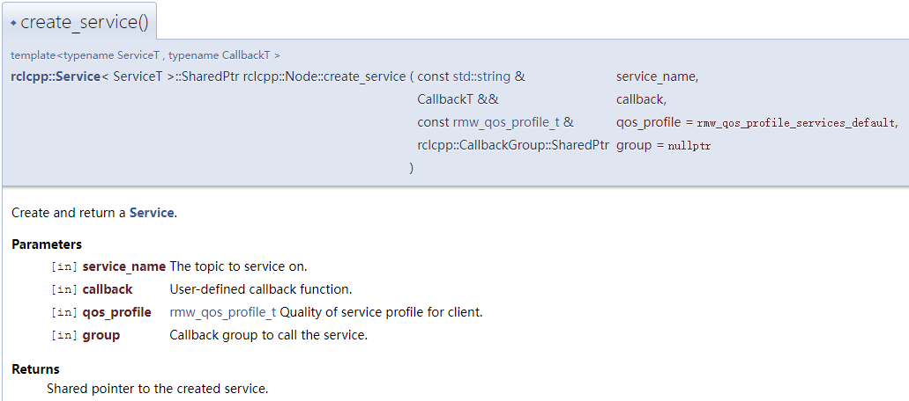
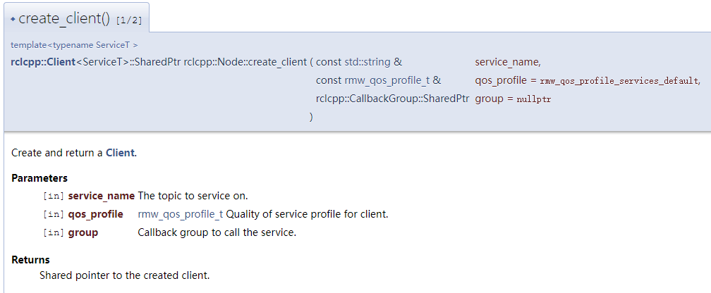

# 5.服务之RCLCPP实现

因为还没有学习如何自定义接口，所以我们先借着上一节的两数相加的示例接口，利用rclcpp提供的接口实现两数相加的服务端和客户端。

## 1.创建功能包和节点

```shell
cd chapt3/chapt3_ws/src
ros2 pkg create example_service_rclcpp --build-type ament_cmake --dependencies rclcpp
touch example_service_rclcpp/src/service_server_01.cpp
touch example_service_rclcpp/src/service_client_01.cpp
```

面向对象方式写两个最简单的节点

service_server_01.cpp

```cpp
#include "rclcpp/rclcpp.hpp"

class ServiceServer01 : public rclcpp::Node {
public:
  ServiceServer01(std::string name) : Node(name) {
    RCLCPP_INFO(this->get_logger(), "节点已启动：%s.", name.c_str());
  }

private:
};

int main(int argc, char** argv) {
  rclcpp::init(argc, argv);
  auto node = std::make_shared<ServiceServer01>("service_server_01");
  rclcpp::spin(node);
  rclcpp::shutdown();
  return 0;
}
```

service_client_01.cpp

```cpp
#include "rclcpp/rclcpp.hpp"

class ServiceClient01 : public rclcpp::Node {
public:
  // 构造函数,有一个参数为节点名称
  ServiceClient01(std::string name) : Node(name) {
    RCLCPP_INFO(this->get_logger(), "节点已启动：%s.", name.c_str());
  }

private:
};

int main(int argc, char** argv) {
  rclcpp::init(argc, argv);
  /*产生一个的节点*/
  auto node = std::make_shared<ServiceClient01>("service_client_01");
  /* 运行节点，并检测退出信号*/
  rclcpp::spin(node);
  rclcpp::shutdown();
  return 0;
}
```

CMakeLists.txt

```shell
add_executable(service_client_01 src/service_client_01.cpp)
ament_target_dependencies(service_client_01 rclcpp)

add_executable(service_server_01 src/service_server_01.cpp)
ament_target_dependencies(service_server_01 rclcpp)

install(TARGETS
  service_server_01
  DESTINATION lib/${PROJECT_NAME}
)

install(TARGETS
  service_client_01
  DESTINATION lib/${PROJECT_NAME}
)
```

完成上面的步骤，即可编译测试了，相信你已经对这些步骤非常熟悉了。

```shell
cd chapt3/chapt3_ws/
colcon build --packages-select example_service_rclcpp

# 运行 service_server_01
source install/setup.bash
ros2 run example_service_rclcpp service_server_01

# 打开新终端运行  service_client_01
source install/setup.bash
ros2 run example_service_rclcpp service_client_01
```

## 2.服务端实现

### 2.1 导入接口

两数相加我们需要利用ROS2自带的`example_interfaces`接口，使用命令行可以查看这个接口的定义。

```
ros2 interface show example_interfaces/srv/AddTwoInts
```

结果

```
int64 a
int64 b
---
int64 sum
```

导入接口的三个步骤不知道你是否还记得。

> `ament_cmake`类型功能包导入消息接口分为三步：
>
> 1. 在`CMakeLists.txt`中导入，具体是先`find_packages`再`ament_target_dependencies`。
> 2. 在`packages.xml`中导入，具体是添加`depend`标签并将消息接口写入。
> 3. 在代码中导入，C++中是`#include"消息功能包/xxx/xxx.hpp"`。

根据步骤改一下：

`CMakeLists.txt`

```
# 这里我们一次性把服务端和客户端对example_interfaces的依赖都加上
find_package(example_interfaces REQUIRED)

add_executable(service_client_01 src/service_client_01.cpp)
ament_target_dependencies(service_client_01 rclcpp example_interfaces)

add_executable(service_server_01 src/service_server_01.cpp)
ament_target_dependencies(service_server_01 rclcpp example_interfaces)
```

`packages.xml`

```
<depend>example_interfaces</depend>
```

代码

```
#include "example_interfaces/srv/add_two_ints.hpp"
```

### 2.2 编写代码

先看代码再解释

```c++
#include "example_interfaces/srv/add_two_ints.hpp"
#include "rclcpp/rclcpp.hpp"

class ServiceServer01 : public rclcpp::Node {
public:
  ServiceServer01(std::string name) : Node(name) {
    RCLCPP_INFO(this->get_logger(), "节点已启动：%s.", name.c_str());
    // 创建服务
    add_ints_server_ =
      this->create_service<example_interfaces::srv::AddTwoInts>(
        "add_two_ints_srv",
        std::bind(&ServiceServer01::handle_add_two_ints, this,
                  std::placeholders::_1, std::placeholders::_2));
  }

private:
  // 声明一个服务
  rclcpp::Service<example_interfaces::srv::AddTwoInts>::SharedPtr
    add_ints_server_;

  // 收到请求的处理函数
  void handle_add_two_ints(
    const std::shared_ptr<example_interfaces::srv::AddTwoInts::Request> request,
    std::shared_ptr<example_interfaces::srv::AddTwoInts::Response> response) {
    RCLCPP_INFO(this->get_logger(), "收到a: %ld b: %ld", request->a,
                request->b);
    response->sum = request->a + request->b;
  };
};
```

create_service，参考rclcpp API文档即可



- ServiceT，消息接口`example_interfaces::srv::AddTwoInts`
- service_name，服务名称
- callback，回调函数，使用成员函数作为回调函数，std::bind进行转换
- qos_profile，服务质量配置文件，默认`rmw_qos_profile_services_default`
- group，调用服务的回调组，默认`nullptr`

### 2.3 测试

```
cd chapt3_ws/
colcon build --packages-select example_service_rclcpp
source install/setup.bash
ros2 run example_service_rclcpp service_server_01
```

接着打开一个新的终端

```
# 你应该可以看到我们声明的服务
ros2 service list
# 使用命令行进行调用
ros2 service call /add_two_ints_srv example_interfaces/srv/AddTwoInts "{a: 5,b: 10}"
```


## 3.客户端实现

### 3.1 API接口

写代码时看API文档是个好习惯，先看看创建客户端的：[地址](https://docs.ros2.org/latest/api/rclcpp/classrclcpp_1_1Node.html#aed42f345ae1de3a1979d5a8076127199)

#### 3.1.1 create_client



参数加上ServiceT（接口类型），一共有四个，都是老熟人了，就不介绍了。

#### 3.1.2 async_send_request

接着我们来看看发送请求的API，[地址](https://docs.ros2.org/latest/api/rclcpp/classrclcpp_1_1Client.html#a62e48edd618bcb73538bfdc3ee3d5e63)


我们这里要用的是这个函数`async_send_request()`同时传入两个参数

- request，请求的消息，这里用于放a，b两个数。
- CallBack，回调函数，异步接收服务器的返回的函数。

> 至于为什么ROS2中那么多回调函数，以及用回调函数的好处，小鱼这里就不解释了，不清楚的小伙伴可以看看基础篇的内容。

#### 3.1.3 wait_for_service

这个函数是用于等待服务上线的，这个函数并不在rclcpp::Client中定义，而是在其[父类](https://docs.ros2.org/latest/api/rclcpp/classrclcpp_1_1ClientBase.html#a8b4b432338a460ceb26a7fa6ddd59e1d)中定义的。


上面是继承图，在其父类中有这个函数的解释。


参数就一个，等待的时间，返回值是bool类型的，上线了就是true，不上线就是false。

之所以会用的这个函数的原因是，再发送请求之前保证服务端启动了，避免发送一个请求出去而无人响应的尴尬局面。

最后还有一些小细节，先看代码小鱼再进一步的解释。

### 3.2 代码

```c++
#include "example_interfaces/srv/add_two_ints.hpp"

class ServiceClient01 : public rclcpp::Node {
public:
  // 构造函数,有一个参数为节点名称
  ServiceClient01(std::string name) : Node(name) {
    RCLCPP_INFO(this->get_logger(), "节点已启动：%s.", name.c_str());
    // 创建客户端
    client_ = this->create_client<example_interfaces::srv::AddTwoInts>("add_two_ints_srv");
  }

  void send_request(int a, int b) {
    RCLCPP_INFO(this->get_logger(), "计算%d+%d", a, b);

    // 1.等待服务端上线
    while (!client_->wait_for_service(std::chrono::seconds(1))) {
      //等待时检测rclcpp的状态
      if (!rclcpp::ok()) {
        RCLCPP_ERROR(this->get_logger(), "等待服务的过程中被打断...");
        return;
      }
      RCLCPP_INFO(this->get_logger(), "等待服务端上线中");
    }

    // 2.构造请求的
    auto request =
      std::make_shared<example_interfaces::srv::AddTwoInts_Request>();
    request->a = a;
    request->b = b;

    // 3.发送异步请求，然后等待返回，返回时调用回调函数
    client_->async_send_request(
      request, std::bind(&ServiceClient01::result_callback_, this,
                         std::placeholders::_1));
  };

private:
  // 声明客户端
  rclcpp::Client<example_interfaces::srv::AddTwoInts>::SharedPtr client_;

  void result_callback_(
    rclcpp::Client<example_interfaces::srv::AddTwoInts>::SharedFuture
      result_future) {
    auto response = result_future.get();
    RCLCPP_INFO(this->get_logger(), "计算结果：%ld", response->sum);
  }
};
```

这里小鱼需要额外讲解的是回调函数`void result_callback_(rclcpp::Client<example_interfaces::srv::AddTwoInts>::SharedFuture result_future)`

这个又臭又长的参数确实让人惊了下，函数的参数是客户端`AddTwoInts`类型的`SharedFuture`对象，这个对象的定义如下


可以看到其又是利用C++11的新特性`std::shared_future`创建的`SharedResponse`类模板。

类模板 `std::shared_future` 提供访问异步操作结果的机制，类似 [std::future](https://www.apiref.com/cpp-zh/cpp/thread/future.html) ，除了允许多个线程等候同一共享状态。

我们具体看看[std::shared_future的API](https://www.apiref.com/cpp-zh/cpp/thread/shared_future.html)


可以看到使用`get`函数即可获取结果。所以下面这段代码的意思相信你已经大概理解了。

```
    auto response = result_future.get();
    RCLCPP_INFO(this->get_logger(), "计算结果：%ld", response->sum);
```

### 3.3 测试

最后还要修改下主函数，用于调用服务端发送请求。

```c++
int main(int argc, char** argv) {
  rclcpp::init(argc, argv);
  /*产生一个的节点*/
  auto node = std::make_shared<ServiceClient01>("service_client_01");
  /* 运行节点，并检测退出信号*/
  //增加这一行，node->send_request(5, 6);，计算5+6结果
  node->send_request(5, 6);
  rclcpp::spin(node);
  rclcpp::shutdown();
  return 0;
}
```

接着编译运行客户端

```
cd chapt3_ws/
colcon build --packages-select example_service_rclcpp
source install/setup.bash
ros2 run example_service_rclcpp service_client_01
```

打开服务端，让服务上线

```
source install/setup.bash
ros2 run example_service_rclcpp service_server_01
```


## 4.总结

本节我们通过RCLCPP完成了服务服务端和客户端的编写，并学了一些C++语言的新特性。下一节我们学习使用rclpy实现相同的功能。


--------------

技术交流&&问题求助：

- **微信公众号及交流群：鱼香ROS**
- **小鱼微信：AiIotRobot**
- **QQ交流群：139707339**

- 版权保护：已加入“维权骑士”（rightknights.com）的版权保护计划
