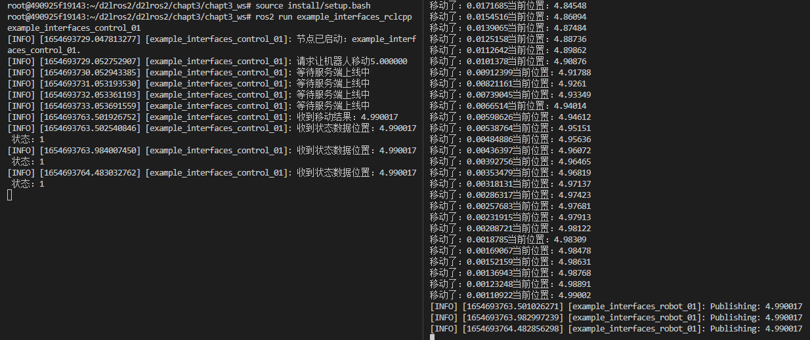

# 8.自定义接口RCLCPP实战

本节我们就利用上一节创建好的消息接口进行代码编写代码，学习在实际的项目中使用自定义接口，同时也作为一个小练习，我们将在同一个节点里融合话题和服务两种通信方式。

## 1.创建功能包和节点

这里我们设计两个节点

- `example_interfaces_robot_01`，机器人节点，对外提供控制机器人移动服务并发布机器人的状态。
- `example_interfaces_control_01`，控制节点，发送机器人移动请求，订阅机器人状态话题。

在工作空间下的src文件夹中创建功能包`example_ros2_interfaces`添加`example_ros2_interfaces`和`rclcpp`依赖，并自动生成`example_interfaces_robot_01`节点。

因为--node-name只支持创建一个节点，我们再添加一下另外一个节点。

```shell
cd chapt3_ws/
ros2 pkg create example_interfaces_rclcpp --build-type ament_cmake --dependencies rclcpp example_ros2_interfaces --destination-directory src --node-name example_interfaces_robot_01 
touch src/example_interfaces_rclcpp/src/example_interfaces_control_01
```

`CMakeLists.txt`

```c++
find_package(ament_cmake REQUIRED)
find_package(rclcpp REQUIRED)
find_package(example_ros2_interfaces REQUIRED)

add_executable(example_interfaces_robot_01 src/example_interfaces_robot_01.cpp)
target_include_directories(example_interfaces_robot_01 PUBLIC
  $<BUILD_INTERFACE:${CMAKE_CURRENT_SOURCE_DIR}/include>
  $<INSTALL_INTERFACE:include>)
target_compile_features(example_interfaces_robot_01 PUBLIC c_std_99 cxx_std_17)  # Require C99 and C++17
ament_target_dependencies(
  example_interfaces_robot_01
  "rclcpp"
  "example_ros2_interfaces"
)

install(TARGETS example_interfaces_robot_01
  DESTINATION lib/${PROJECT_NAME})


add_executable(example_interfaces_control_01 src/example_interfaces_control_01.cpp)
target_include_directories(example_interfaces_control_01 PUBLIC
  $<BUILD_INTERFACE:${CMAKE_CURRENT_SOURCE_DIR}/include>
  $<INSTALL_INTERFACE:include>)
target_compile_features(example_interfaces_control_01 PUBLIC c_std_99 cxx_std_17)  # Require C99 and C++17
ament_target_dependencies(
  example_interfaces_control_01
  "rclcpp"
  "example_ros2_interfaces"
)

install(TARGETS example_interfaces_control_01
  DESTINATION lib/${PROJECT_NAME})
```

面向对象写一下两个节点的内容

example_interfaces_control_01.cpp

```c++
 #include "rclcpp/rclcpp.hpp"

class ExampleInterfacesControl : public rclcpp::Node {
public:
  // 构造函数,有一个参数为节点名称
  ExampleInterfacesControl(std::string name) : Node(name) {
    RCLCPP_INFO(this->get_logger(), "节点已启动：%s.", name.c_str());
  }

private:
};

int main(int argc, char** argv) {
  rclcpp::init(argc, argv);
  auto node = std::make_shared<ExampleInterfacesControl>("example_interfaces_control_01");
  rclcpp::spin(node);
  rclcpp::shutdown();
  return 0;
}

```

example_interfaces_robot_01.cpp

```c++
#include "rclcpp/rclcpp.hpp"

/*创建一个机器人类，模拟真实机器人*/
class Robot {
public:
  Robot() = default;
  ~Robot() = default;
private:
};


class ExampleInterfacesRobot : public rclcpp::Node {
public:
  ExampleInterfacesRobot(std::string name) : Node(name) {
    RCLCPP_INFO(this->get_logger(), "节点已启动：%s.", name.c_str());
  }

private:
  Robot robot;
};

int main(int argc, char** argv) {
  rclcpp::init(argc, argv);
  auto node = std::make_shared<ExampleInterfacesRobot>("example_interfaces_robot_01");
  rclcpp::spin(node);
  rclcpp::shutdown();
  return 0;
}
```

保存编译即可测试

```shell
cd chapt3_ws/
colcon build
source install/setup.bash
```

## 2.编写机器人类

```c++
// 导入上一节定义的消息接口
#include "example_ros2_interfaces/msg/robot_status.hpp"
#include "example_ros2_interfaces/srv/move_robot.hpp"
#include "rclcpp/rclcpp.hpp"

/*
 * 测试指令：ros2 service call /move_robot example_ros2_interfaces/srv/MoveRobot "{distance: 5}"
 */

class Robot {
public:
  Robot() = default;
  ~Robot() = default;
  /**
   * @brief 移动指定的距离
   *
   * @param distance
   * @return float
   */
  float move_distance(float distance) {
    status_ = example_ros2_interfaces::msg::RobotStatus::STATUS_MOVEING;
    target_pose_ += distance;
    // 当目标距离和当前距离大于0.01则持续向目标移动
    while (fabs(target_pose_ - current_pose_) > 0.01) {
      // 每一步移动当前到目标距离的1/10
      float step = distance / fabs(distance) * fabs(target_pose_ - current_pose_) * 0.1;
      current_pose_ += step;
      std::cout << "移动了：" << step << "当前位置：" << current_pose_ << std::endl;
      // 当前线程休眠500ms
      std::this_thread::sleep_for(std::chrono::milliseconds(500));
    }
    status_ = example_ros2_interfaces::msg::RobotStatus::STATUS_STOP;
    return current_pose_;
  }
  /**
   * @brief Get the current pose
   *
   * @return float
   */
  float get_current_pose() { return current_pose_; }

  /**
   * @brief Get the status
   *
   * @return int
   *  1 example_ros2_interfaces::msg::RobotStatus::STATUS_MOVEING
   *  2 example_ros2_interfaces::msg::RobotStatus::STATUS_STOP
   */
  int get_status() { return status_; }

private:
  // 声明当前位置
  float current_pose_ = 0.0;
  // 目标距离
  float target_pose_ = 0.0;
  int status_ = example_ros2_interfaces::msg::RobotStatus::STATUS_STOP;
};
```

该类的实现比较简单，对外提供获取当前状态、获取当前位置和移动一定的距离三个接口，其中移动指定距离这个函数每移动一步会休眠500ms。

## 3.编写机器人节点逻辑

接着我们就可以利用接口编写机器人节点了

```c++

class ExampleInterfacesRobot : public rclcpp::Node {
public:
  ExampleInterfacesRobot(std::string name) : Node(name) {
    RCLCPP_INFO(this->get_logger(), "节点已启动：%s.", name.c_str());
    /*创建move_robot服务*/
    move_robot_server_ = this->create_service<example_ros2_interfaces::srv::MoveRobot>(
      "move_robot", std::bind(&ExampleInterfacesRobot::handle_move_robot, this, std::placeholders::_1, std::placeholders::_2));
    /*创建发布者*/
    robot_status_publisher_ = this->create_publisher<example_ros2_interfaces::msg::RobotStatus>("robot_status", 10);
    /*创建一个周期为500ms的定时器*/
    timer_ = this->create_wall_timer(std::chrono::milliseconds(500), std::bind(&ExampleInterfacesRobot::timer_callback, this));
  }

private:
  Robot robot; /*实例化机器人*/
  rclcpp::TimerBase::SharedPtr timer_; /*定时器，用于定时发布机器人位置*/
  rclcpp::Service<example_ros2_interfaces::srv::MoveRobot>::SharedPtr move_robot_server_; /*移动机器人服务*/
  rclcpp::Publisher<example_ros2_interfaces::msg::RobotStatus>::SharedPtr robot_status_publisher_; /*发布机器人位姿发布者*/

  /**
   * @brief 500ms 定时回调函数，
   * 
   */
  void timer_callback() {
    // 创建消息
    example_ros2_interfaces::msg::RobotStatus message;
    message.status = robot.get_status();
    message.pose = robot.get_current_pose();
    RCLCPP_INFO(this->get_logger(), "Publishing: %f", robot.get_current_pose());
    // 发布消息
    robot_status_publisher_->publish(message);
  };

  /**
   * @brief 收到话题数据的回调函数
   * 
   * @param request 请求共享指针，包含移动距离
   * @param response 响应的共享指针，包含当前位置信息
   */
  void handle_move_robot(const std::shared_ptr<example_ros2_interfaces::srv::MoveRobot::Request> request,
                         std::shared_ptr<example_ros2_interfaces::srv::MoveRobot::Response> response) {
    RCLCPP_INFO(this->get_logger(), "收到请求移动距离：%f，当前位置：%f", request->distance, robot.get_current_pose());
    robot.move_distance(request->distance);
    response->pose = robot.get_current_pose();
  };
};
```

逻辑也比较简单，利用定时器不断发送数据，收到请求后调用机器人类的move_distance接口来移动机器人。

## 4.编写控制节点

控制节点类代码

头文件部分

```
#include "rclcpp/rclcpp.hpp"
#include "example_ros2_interfaces/srv/move_robot.hpp"
#include "example_ros2_interfaces/msg/robot_status.hpp"

```

`ExampleInterfacesControl`类

```c++

class ExampleInterfacesControl : public rclcpp::Node {
public:
  ExampleInterfacesControl(std::string name) : Node(name) {
    RCLCPP_INFO(this->get_logger(), "节点已启动：%s.", name.c_str());
    /*创建move_robot客户端*/
    client_ = this->create_client<example_ros2_interfaces::srv::MoveRobot>(
      "move_robot");
    /*订阅机器人状态话题*/
    robot_status_subscribe_ = this->create_subscription<example_ros2_interfaces::msg::RobotStatus>("robot_status", 10, std::bind(&ExampleInterfacesControl::robot_status_callback_, this, std::placeholders::_1));
  }


  /**
   * @brief 发送移动机器人请求函数
   * 步骤：1.等待服务上线
   *      2.构造发送请求
   * 
   * @param distance 
   */
  void move_robot(float distance) {
    RCLCPP_INFO(this->get_logger(), "请求让机器人移动%f", distance);

    /*等待服务端上线*/
    while (!client_->wait_for_service(std::chrono::seconds(1))) {
      //等待时检测rclcpp的状态
      if (!rclcpp::ok()) {
        RCLCPP_ERROR(this->get_logger(), "等待服务的过程中被打断...");
        return;
      }
      RCLCPP_INFO(this->get_logger(), "等待服务端上线中");
    }

    // 构造请求
    auto request = 
      std::make_shared<example_ros2_interfaces::srv::MoveRobot::Request>();
    request->distance = distance;

    // 发送异步请求，然后等待返回，返回时调用回调函数
    client_->async_send_request(
      request, std::bind(&ExampleInterfacesControl::result_callback_, this,
                         std::placeholders::_1));
  };

private:
  // 声明客户端
  rclcpp::Client<example_ros2_interfaces::srv::MoveRobot>::SharedPtr client_;
  rclcpp::Subscription<example_ros2_interfaces::msg::RobotStatus>::SharedPtr robot_status_subscribe_;
  /* 机器人移动结果回调函数 */
  void result_callback_(
    rclcpp::Client<example_ros2_interfaces::srv::MoveRobot>::SharedFuture
      result_future) {
    auto response = result_future.get();
    RCLCPP_INFO(this->get_logger(), "收到移动结果：%f", response->pose);
  }

  /**
   * @brief 机器人状态话题接收回调函数
   * 
   * @param msg 
   */
  void robot_status_callback_(const example_ros2_interfaces::msg::RobotStatus::SharedPtr msg)
  {
    RCLCPP_INFO(this->get_logger(), "收到状态数据位置：%f 状态：%d", msg->pose ,msg->status);
  }
};
```

main函数

```c++
int main(int argc, char** argv) {
  rclcpp::init(argc, argv);
  auto node = std::make_shared<ExampleInterfacesControl>("example_interfaces_control_01");
  /*这里调用了服务，让机器人向前移动5m*/
  node->move_robot(5.0);
  rclcpp::spin(node);
  rclcpp::shutdown();
  return 0;
}
```

## 5.测试运行

### 5.1 编译

```shell
colcon build --packages-up-to example_interfaces_rclcpp
```

又遇到了个新的指令`--packages-up-to`，在colcon使用进阶篇小鱼有讲到，编译一个节点及其依赖，使用这个指令你会发现，以先后顺序编译了`example_ros2_interfaces`再编译`example_interfaces_rclcpp`。


### 5.2 测试

控制端

```shell
source install/setup.bash
ros2 run example_interfaces_rclcpp example_interfaces_control_01
```

服务端

```shell
source install/setup.bash
ros2 run example_interfaces_rclcpp  example_interfaces_robot_01
```

服务端启动后机器人开始移动，时间为：`1654693733.053691559`


移动结束，`收到移动结果：4.990017`，时间为：`1654693763.501926752`



### 5.3 思考

虽然机器人可以移动了，客户端也可以收到机器人的位置了，但是聪明的你应该发现了，在机器人移动期间，控制端就收不到了来自机器人端的实时位置信息的话题发布了。

原因是服务端调用机器人移动的时候造成了主线程的阻塞和休眠，只有机器人完成移动后才会退出，造成了发布数据的定时器回调无法正常进行。

解决这个问题的方法有很多，比如开个单独给服务开个线程，比如换一种通信方式，带着问题和好奇心，我们继续学习，小鱼将带你解决掉它。
