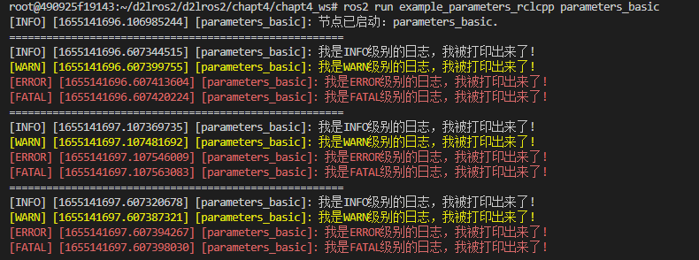
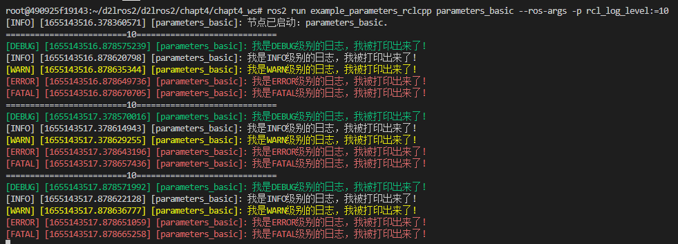

# 2.参数之RCLCPP实现

上节我们通过参数控制了小乌龟模拟器的背景色，但是我们并不知道小乌龟模拟器是如何接收到参数并将其应用的，本节我们就学习使用ROS2的RCLCPP中参数相关的API实现对ROS2打印的日志级别控制。

ROS2将日志分为五个级别，在RCLCPP中通过不同的宏可以实现不同日志级别日志的打印，例程如下：

```cpp
RCLCPP_DEBUG(this->get_logger(), "我是DEBUG级别的日志，我被打印出来了!");
RCLCPP_INFO(this->get_logger(), "我是INFO级别的日志，我被打印出来了!");
RCLCPP_WARN(this->get_logger(), "我是WARN级别的日志，我被打印出来了!");
RCLCPP_ERROR(this->get_logger(), "我是ERROR级别的日志，我被打印出来了!");
RCLCPP_FATAL(this->get_logger(), "我是FATAL级别的日志，我被打印出来了!");
```

有时候日志太多，会让人眼花缭乱找不到重要信息，所以我们需要对日志的级别进行过滤，比如只看INFO以上级别的，ROS2中可以通过已有的API设置日志的级别，RCLCPP中API如下：

```
this->get_logger().set_level(log_level);
```

## 1.创建功能包和节点

我们创建一个功能包和测试节点，声明参数并实现动态修改打印的日志级别功能。

```shell
mkdir -p chapt4/chapt4_ws/
ros2 pkg create example_parameters_rclcpp --build-type ament_cmake --dependencies rclcpp --destination-directory src --node-name parameters_basic --maintainer-name "fishros" --maintainer-email "fishros@foxmail.com"
```

**parameters_basic.cpp**

```c++
#include <chrono>
#include "rclcpp/rclcpp.hpp"

class ParametersBasicNode : public rclcpp::Node {
 public:
  explicit ParametersBasicNode(std::string name) : Node(name) {
    RCLCPP_INFO(this->get_logger(), "节点已启动：%s.", name.c_str());
  }
 private:
};

int main(int argc, char** argv) {
  rclcpp::init(argc, argv);
  /*产生一个的节点*/
  auto node = std::make_shared<ParametersBasicNode>("parameters_basic");
  /* 运行节点，并检测退出信号*/
  rclcpp::spin(node);
  rclcpp::shutdown();
  return 0;
}
```

构建测试

```shell
colon build  --packages-select example_parameters_rclcpp
source install/setup.bash
ros2 run example_parameters_rclcpp parameters_basic
```

## 2.RCLCPP参数API

在RCLCPP的API中，关于参数相关的函数比较多些，但都是围绕[参数获取](https://docs.ros2.org/latest/api/rclcpp/classrclcpp_1_1Node.html#a25890d01a2cd47ce99af887f556c529b)、[参数设置](https://docs.ros2.org/latest/api/rclcpp/classrclcpp_1_1Node.html#a7d8af4dc449c7130ccc396814b86c14d)、[参数描述](https://docs.ros2.org/latest/api/rclcpp/classrclcpp_1_1Node.html#adbfb47c0983e14482c39159b274f6308)、[列出参数](https://docs.ros2.org/latest/api/rclcpp/classrclcpp_1_1Node.html#a37aa95886a706c174db77c2b160f6d7d)、[添加](https://docs.ros2.org/latest/api/rclcpp/classrclcpp_1_1Node.html#a12d535bced9f26b65c0a450e6f40aff8)和[移除](https://docs.ros2.org/latest/api/rclcpp/classrclcpp_1_1Node.html#a15d4f7fa0ef760941b6a78f42cccb7e0)参数回调事件。

- [rclcpp: rclcpp: ROS Client Library for C++ (ros2.org)](https://docs.ros2.org/latest/api/rclcpp/)

## 3.使用参数控制节点日志级别

```cpp
#include <chrono>
#include "rclcpp/rclcpp.hpp"
/*
    # declare_parameter	        声明和初始化一个参数
    # describe_parameter(name)  通过参数名字获取参数的描述
    # get_parameter	            通过参数名字获取一个参数
    # set_parameter	            设置参数的值
*/
class ParametersBasicNode : public rclcpp::Node {
 public:
  // 构造函数,有一个参数为节点名称
  explicit ParametersBasicNode(std::string name) : Node(name) {
    RCLCPP_INFO(this->get_logger(), "节点已启动：%s.", name.c_str());
    this->declare_parameter("rcl_log_level", 0);     /*声明参数*/
    this->get_parameter("rcl_log_level", log_level); /*获取参数*/
    /*设置日志级别*/
    this->get_logger().set_level((rclcpp::Logger::Level)log_level);
    using namespace std::literals::chrono_literals;
    timer_ = this->create_wall_timer(
        500ms, std::bind(&ParametersBasicNode::timer_callback, this));
  }

 private:
  int log_level;
  rclcpp::TimerBase::SharedPtr timer_;

  void timer_callback() {
    this->get_parameter("rcl_log_level", log_level); /*获取参数*/
    /*设置日志级别*/
    this->get_logger().set_level((rclcpp::Logger::Level)log_level);
    std::cout<<"======================================================"<<std::endl;
    RCLCPP_DEBUG(this->get_logger(), "我是DEBUG级别的日志，我被打印出来了!");
    RCLCPP_INFO(this->get_logger(), "我是INFO级别的日志，我被打印出来了!");
    RCLCPP_WARN(this->get_logger(), "我是WARN级别的日志，我被打印出来了!");
    RCLCPP_ERROR(this->get_logger(), "我是ERROR级别的日志，我被打印出来了!");
    RCLCPP_FATAL(this->get_logger(), "我是FATAL级别的日志，我被打印出来了!");
  }
};

int main(int argc, char** argv) {
  rclcpp::init(argc, argv);
  /*产生一个的节点*/
  auto node = std::make_shared<ParametersBasicNode>("parameters_basic");
  /* 运行节点，并检测退出信号*/
  rclcpp::spin(node);
  rclcpp::shutdown();
  return 0;
}
```

代码解析

这里我们使用了三个参数相关的函数和一个设置节点日志级别的函数

- declare_parameter，参数有两个参数名和参数值。
- get_parameter，参数有两个，参数名和放入结果的变量。

设置日志级别

- set_level，设置日志级别，ROS2的日志级别定义在文件`/opt/ros/humble/include/rcutils/rcutils/logging.h`的167-175行。

  ```cpp
  /// The severity levels of log messages / loggers.
  enum RCUTILS_LOG_SEVERITY
  {
    RCUTILS_LOG_SEVERITY_UNSET = 0,  ///< The unset log level
    RCUTILS_LOG_SEVERITY_DEBUG = 10,  ///< The debug log level
    RCUTILS_LOG_SEVERITY_INFO = 20,  ///< The info log level
    RCUTILS_LOG_SEVERITY_WARN = 30,  ///< The warn log level
    RCUTILS_LOG_SEVERITY_ERROR = 40,  ///< The error log level
    RCUTILS_LOG_SEVERITY_FATAL = 50,  ///< The fatal log level
  };
  ```

## 4.编译测试

```shell
colcon build --packages-select example_parameters_rclcpp
source install/setup.bash
ros2 run example_parameters_rclcpp parameters_basic
```

运行后你会发现DEBUG级别的日志并没有被打印出来，原因在于我们将节点的日志级别设置为了0，0对应的日志级别为`RCUTILS_LOG_SEVERITY_UNSET`即未设置使用默认级别，**节点默认的日志级别就是INFO级别**的，所以只能打印INFO以上的日志信息。



运行节点的时候可以指定参数的值，我们尝试将`log_level`的值改成`10`即`DEBUG`级别。

```shell
ros2 run example_parameters_rclcpp parameters_basic --ros-args -p rcl_log_level:=10
```



再试试其他级别-FATAL


除了在节点运行前通过CLI传递参数，在运动的过程中也可以动态的修改参数

```shell
#查看参数列表
ros2 param list 
#设置参数级别
ros2 param set /parameters_basic rcl_log_level 10
```


## 5.总结

上面我们通过参数实现了动态控制节点日志级别的功能，其实像这样的功能ROS2早已为我们准备好了，在运行任意节点时候可以通过CLI传递日志级别配置。

```shell
ros2 run package-name node-name --ros-args --log-level debug
```

除了命令行设置参数和查看日志，通过rqt也可以可视化设置和查看

