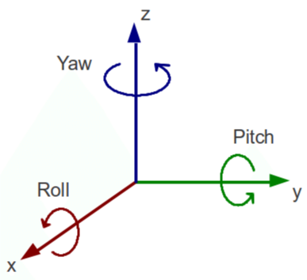

# 1.tf2介绍

TF即`变换`的英文单词`TransForm`的缩写。所以`ROS`和`ROS2`中的`TF`就是指和坐标变换相关的工具。

> 在搞机器人当中，坐标变换经常用到，所以`ROS2`帮我们做了一个强大易用的TF工具


## 1.发布坐标关系

我们先使用TF2的相关工具，解决上一节的手眼坐标转换问题，直观的感受一下TF2的强大。

要想让TF帮我们完成坐标变换，我们就需要告诉它坐标和坐标之间的关系。


拿上面的手眼系统来说，我们要想获取到相机的基坐标系{B}和工具{P}之间的关系，只需要将机械臂和相机、相机和工具之间的关系告诉TF即可。

## 2.我们如何告诉TF？

可以使用tf的坐标广播工具进行广播坐标关系，广播时需要三个数据：

- 父坐标系名称（字符串）
- 子坐标系名称（字符串）
- 父子之间的变换关系（平移关系和旋转关系）

在终端中输入：

```
ros2 run tf2_ros static_transform_publisher 
```

按`enter`键，可以看到

```
A command line utility for manually sending a transform.
Usage: static_transform_publisher x y z qx qy qz qw frame_id child_frame_id 
OR 
Usage: static_transform_publisher x y z yaw pitch roll frame_id child_frame_id 
```

这是该CLI所提供的使用提示，可以看出

使用TF发布位置和姿态时，位置的描述使用的是xyz三个参数，而姿态的描述则分两种

- 第一种是四元数形式（qx qy qz qw）
- 第二种是欧拉角形式（yaw偏航角-rz pitch俯仰角-ry roll滚转角-rx），我们这里采用的是欧拉形式，绕x轴旋转采用欧拉角中的滚转角roll来描述，注意角度单位采用弧度制。



>  关于欧拉角和四元数的区别我们放到了姿态的多种表示章节来讲。


### 2.1 发布B到C的位姿

比如针对上面的手眼转换，广播机械臂坐标系{B}和相机坐标系{C}之间的关系。

父坐标系的名字就是B，子坐标系的名字是C，父子之间的平移关系是`0 0 3`,旋转关系是绕x轴旋转180度。

在ROS2中可以使用下面的指令发布变换，打开终端，输入下面的指令：

```
ros2 run tf2_ros static_transform_publisher 0 0 3 0 0 3.14 B C
```

如果在终端中看到下面的提示则代表发布成功


### 2.2 发布C到P的位姿

接着我们发布坐标系{C}到坐标系{T}的位姿

再打开一个新的终端，输入下面的命令：

```
ros2 run tf2_ros static_transform_publisher 2 1 2 0 0 0 C P
```

## 3. 监听/获取TF关系

发布也发布了，接着我们就把坐标系之间的关系打印出来，只要坐标系之间是有连接的，我们就可以使用TF求出来，使用下面的指令就可以得到机械臂基坐标系{B}和工具坐标系{P}之间的关系。

打开终端,输入命令：

```bash
ros2 run tf2_ros tf2_echo B P
```


可以看到终端中不断输出B和C之间的平移和旋转，平移采用的是xyz，基本正确，y和z的微小差异是因为我们发布变换时旋转输入的是3.14并不精确。

至于旋转部分采用的是四元数表示，关于这部分姿态的表示，小鱼在下一节会讲，大家不必纠结。

除了使用TF获取关系外，ros2还提供很多工具来查看坐标之间的关系，大家可以在终端中输入下面的命令自行尝试。

## 4.TF常用工具

### 4.1 rqt_tf_tree

> 2022-04-26更新的，这个工具的二进制安装版本作者3月底才发布，之前没提的原因是需要源码装太麻烦了

这个工具需要我们手动安装下

```
sudo apt install ros-foxy-rqt-tf-tree
```

安装完成后，再次打开rqt工具，`Plugins`->`Visualization`->`TF Tree`


接着你就可以看到这个强大的，几乎可以实时看到系统tf更新信息的工具，这个工具对于后面我们进行导航和机械臂的调试非常有帮助。

> 长的不一样没关系，这是后面补充的图。


### 4.2 tf2_monitor

查看所有的发布者和频率。

```
ros2 run tf2_ros tf2_monitor 
Gathering data on all frames for 10 seconds...

RESULTS: for all Frames

Frames:
Frame: C, published by <no authority available>, Average Delay: 3001.98, Max Delay: 3001.98
Frame: P, published by <no authority available>, Average Delay: 741.497, Max Delay: 741.497
All Broadcasters:
Node: <no authority available> 5029.14 Hz, Average Delay: 1871.74 Max Delay: 3001.98


RESULTS: for all Frames
Frames:
Frame: C, published by <no authority available>, Average Delay: 3001.98, Max Delay: 3001.98
Frame: P, published by <no authority available>, Average Delay: 741.497, Max Delay: 741.497
All Broadcasters:
Node: <no authority available> 5029.14 Hz, Average Delay: 1871.74 Max Delay: 3001.98


```

##### view_frames.py

可以生成TF的pdf，目前也有在线的实时查看工具。

```
ros2 run tf2_tools view_frames.py 
[INFO] [1636558316.667894410] [view_frames]: Listening to tf data during 5 seconds...
[INFO] [1636558321.702280144] [view_frames]: Generating graph in frames.pdf file...
[INFO] [1636558321.709904442] [view_frames]: Result:tf2_msgs.srv.FrameGraph_Response(frame_yaml="C: \n  parent: 'B'\n  broadcaster: 'default_authority'\n  rate: 10000.000\n  most_recent_transform: 0.000000\n  oldest_transform: 0.000000\n  buffer_length: 0.000\nP: \n  parent: 'C'\n  broadcaster: 'default_authority'\n  rate: 10000.000\n  most_recent_transform: 0.000000\n  oldest_transform: 0.000000\n  buffer_length: 0.000\n")
/opt/ros/foxy/lib/tf2_tools/view_frames.py:75: YAMLLoadWarning: calling yaml.load() without Loader=... is deprecated, as the default Loader is unsafe. Please read https://msg.pyyaml.org/load for full details.
  data = yaml.load(result.frame_yaml)

```


除了使用命令行进行坐标关系的广播和监听，我们还可以使用代码来广播和监听，接下来小鱼就带你一起用程序来发布TF广播和获取坐标关系。


